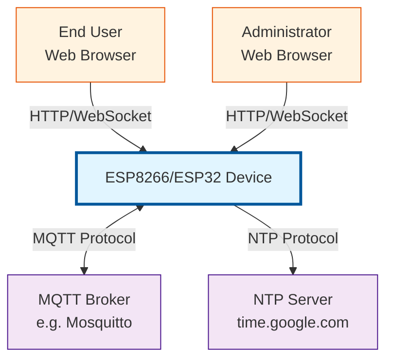

# ESP8266-React Framework Architecture

## Overview

The ESP8266-React framework is a comprehensive IoT platform that provides a secure, extensible foundation for building embedded web applications on ESP8266 and ESP32 microcontrollers. The framework combines a C++ backend with a React-based frontend, offering a complete solution for WiFi management, MQTT integration, OTA updates, and custom IoT features.

## System Purpose

This framework enables developers to rapidly build IoT applications with:
- **Web-based configuration** - Modern, responsive UI for device configuration
- **Real-time communication** - WebSocket and MQTT support for live updates
- **Secure access control** - JWT-based authentication and authorization
- **Remote management** - OTA firmware updates and system monitoring
- **Extensible architecture** - Reusable patterns for adding custom features

## Technology Stack

### Backend (ESP8266/ESP32)
- **Platform**: Arduino framework on ESP8266/ESP32
- **Language**: C++ (C++11/14 features)
- **Web Server**: ESPAsyncWebServer (async, non-blocking)
- **Filesystem**: LittleFS (wear-leveling flash storage)
- **MQTT Client**: AsyncMqttClient
- **JSON**: ArduinoJson (v6.x)
- **Build System**: PlatformIO

### Frontend (React SPA)
- **Framework**: React 18.1.0
- **Language**: TypeScript 4.6.4
- **UI Library**: Material-UI (MUI) 5.8.0
- **Routing**: React Router 6.3.0
- **HTTP Client**: Axios 0.27.2
- **WebSocket**: Sockette 2.0.6
- **State Management**: React Context API + Hooks
- **Notifications**: Notistack 2.0.5
- **Build Tool**: React Scripts 5.0.1 with react-app-rewired

## High-Level Architecture

## Core Architectural Principles

### 1. Stateful Service Pattern
All data management in the framework is built around the `StatefulService<T>` template, which provides:
- Thread-safe state access (mutex on ESP32)
- Event-driven update notifications
- Origin tracking for update propagation
- Composable infrastructure components

### 2. Single-Layer Service Architecture
Weighsoft services use a **single-layer pattern** for protocol integration:
- Application services directly compose framework components (`HttpEndpoint`, `WebSocketTxRx`, `MqttPubSub`, `BlePubSub`)
- Protocol configuration (MQTT topics, BLE UUIDs) is managed inline within the service
- No separate settings services for protocol configuration
- Simplifies maintenance and reduces technical debt for industrial devices

**Example**: `LedExampleService` composes `MqttPubSub` directly and manages MQTT topics inline, rather than depending on a separate `LedMqttSettingsService`.

**Rationale**: Industrial IoT devices typically have one primary function (scale, relay, sensor) and don't need runtime configuration of protocol parameters. Inline configuration is simpler and sufficient.

### 3. Infrastructure Composition
Services compose infrastructure components rather than using inheritance:
- `HttpEndpoint<T>` - REST API exposure
- `FSPersistence<T>` - Filesystem persistence
- `WebSocketTxRx<T>` - Real-time bidirectional communication
- `MqttPubSub<T>` - MQTT pub/sub integration
- `BlePubSub<T>` - BLE characteristic-based communication (Phase 2)

### 4. Security by Design
- JWT-based authentication with configurable expiry
- Authorization predicates (NONE_REQUIRED, IS_AUTHENTICATED, IS_ADMIN)
- Secure WebSocket filtering
- Request wrapping for protected endpoints

### 5. Feature Modularity
- Compile-time feature flags (FT_SECURITY, FT_MQTT, FT_NTP, FT_OTA, FT_UPLOAD_FIRMWARE, FT_BLE)
- Conditional compilation for memory optimization
- Optional services based on project requirements

### 6. Event-Driven Updates
- Update handlers propagate state changes
- Origin ID prevents circular updates across multiple channels
- Multiple communication channels (REST, WebSocket, MQTT, BLE) synchronized automatically

## System Capabilities

### Core Features (Always Available)
- **WiFi Management**: Station mode configuration, network scanning, connection status
- **Access Point**: Configurable AP mode (always-on or fallback), SSID configuration
- **System Management**: Status monitoring, restart, factory reset
- **Feature Discovery**: Dynamic feature flag exposure to frontend

### Optional Features (Configurable)
- **Security**: JWT authentication, user management, role-based access control
- **MQTT**: Broker connection, pub/sub topics, Home Assistant integration
- **NTP**: Network time synchronization, timezone configuration
- **OTA Updates**: Over-the-air firmware updates, version management
- **Firmware Upload**: Manual firmware upload via web interface

## Key Design Decisions

### Backend Decisions

1. **Async Web Server**: Non-blocking I/O prevents request handling from blocking WiFi/MQTT operations
2. **Template-Based Services**: Type-safe, reusable patterns reduce code duplication
3. **LittleFS over SPIFFS**: Better wear-leveling and performance
4. **JSON Serialization**: Human-readable, web-friendly data format
5. **Update Handler Pattern**: Decouples state management from side effects

### Frontend Decisions

1. **React Context over Redux**: Simpler state management for small to medium complexity
2. **TypeScript**: Type safety prevents runtime errors
3. **Material-UI**: Professional, responsive, accessible UI components
4. **Axios over Fetch**: Better error handling, interceptors, request cancellation
5. **Sockette**: Automatic WebSocket reconnection with exponential backoff

### Communication Decisions

1. **REST for Configuration**: CRUD operations with clear semantics
2. **WebSocket for Real-Time**: Bidirectional updates for live status
3. **MQTT for Integration**: Standard protocol for home automation
4. **Origin Tracking**: Prevents update loops across channels

## Memory Considerations

### Backend Memory Profile
- **Minimum Flash**: 2MB (recommended 4MB)
- **RAM Usage**: ~40-50KB framework overhead
- **PROGMEM WWW**: ~150KB for frontend assets (optional)
- **LittleFS**: Configurable partition size

### Optimization Strategies
1. **Feature Flags**: Disable unused features at compile time
2. **PROGMEM Storage**: Serve frontend from flash instead of filesystem
3. **Buffer Sizing**: Configurable JSON buffer sizes per service
4. **Connection Limits**: Limit concurrent WebSocket/HTTP connections

## Deployment Models

### 1. PROGMEM WWW (Default)
- Frontend compiled into firmware
- No filesystem upload needed
- Faster page loads
- Requires larger flash partition

### 2. Filesystem WWW
- Frontend served from LittleFS
- Separate upload step required
- Smaller firmware binary
- Frontend updatable independently

### 3. Hybrid
- Critical pages in PROGMEM
- Assets in filesystem
- Balance between size and flexibility

## Extensibility Points

Developers can extend the framework at multiple levels:

1. **New Services**: Create custom stateful services for sensors, actuators, etc.
2. **REST Endpoints**: Add custom API endpoints for project-specific features
3. **WebSocket Handlers**: Implement real-time data streaming
4. **MQTT Topics**: Integrate with home automation systems
5. **UI Components**: Add custom pages and configuration screens
6. **Authentication Predicates**: Custom authorization logic

## Documentation Structure

This documentation is organized into multiple files:

- **[C4-CONTEXT.md](C4-CONTEXT.md)** - System context and external actors
- **[C4-CONTAINER.md](C4-CONTAINER.md)** - Container architecture
- **[C4-COMPONENT-BACKEND.md](C4-COMPONENT-BACKEND.md)** - Backend components
- **[C4-COMPONENT-FRONTEND.md](C4-COMPONENT-FRONTEND.md)** - Frontend components
- **[C4-CODE-PATTERNS.md](C4-CODE-PATTERNS.md)** - Code-level patterns
- **[SEQUENCE-DIAGRAMS.md](SEQUENCE-DIAGRAMS.md)** - Interaction flows
- **[DATA-FLOWS.md](DATA-FLOWS.md)** - Data movement and state propagation
- **[API-REFERENCE.md](API-REFERENCE.md)** - Complete API contracts
- **[DESIGN-PATTERNS.md](DESIGN-PATTERNS.md)** - Pattern catalog
- **[EXTENSION-GUIDE.md](EXTENSION-GUIDE.md)** - How to extend the framework
- **[CONFIGURATION.md](CONFIGURATION.md)** - Build and factory settings
- **[SECURITY.md](SECURITY.md)** - Security architecture
- **[FILE-REFERENCE.md](FILE-REFERENCE.md)** - File structure guide

## Quick Start for Developers

### Understanding the Framework
1. Read [C4-CONTEXT.md](C4-CONTEXT.md) for system boundaries
2. Study [C4-CONTAINER.md](C4-CONTAINER.md) for container interactions
3. Review [C4-COMPONENT-BACKEND.md](C4-COMPONENT-BACKEND.md) for service patterns
4. Examine [DESIGN-PATTERNS.md](DESIGN-PATTERNS.md) for implementation patterns

### Extending the Framework
1. Follow [EXTENSION-GUIDE.md](EXTENSION-GUIDE.md) for step-by-step instructions
2. Reference the demo light control service in `src/LightStateService.*`
3. Use [API-REFERENCE.md](API-REFERENCE.md) for endpoint design
4. Check [SEQUENCE-DIAGRAMS.md](SEQUENCE-DIAGRAMS.md) for interaction patterns

### Configuration and Deployment
1. Review [CONFIGURATION.md](CONFIGURATION.md) for build options
2. Modify `features.ini` to enable/disable features
3. Customize `factory_settings.ini` for default values
4. Use [SECURITY.md](SECURITY.md) for production hardening

## Version Information

- **Framework Version**: Based on ESP8266-React template
- **Target Platforms**: ESP8266 (esp12e), ESP32 (node32s)
- **Arduino Framework**: ESP8266 Core 2.x, ESP32 Core 1.x/2.x
- **PlatformIO**: 6.x+
- **React**: 18.x
- **Material-UI**: 5.x

## License

This framework is provided under the terms specified in LICENSE.txt.

## Next Steps

- [C4-CONTEXT.md](C4-CONTEXT.md) - Understand system context and boundaries
- [DESIGN-PATTERNS.md](DESIGN-PATTERNS.md) - Learn core design patterns
- [EXTENSION-GUIDE.md](EXTENSION-GUIDE.md) - Build your first custom feature
