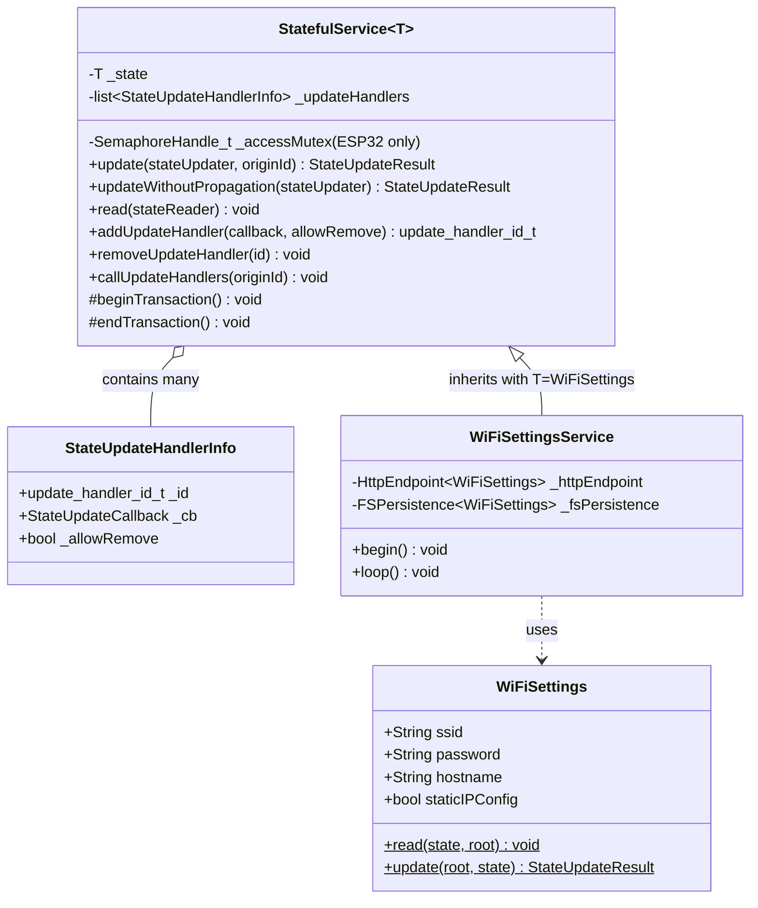
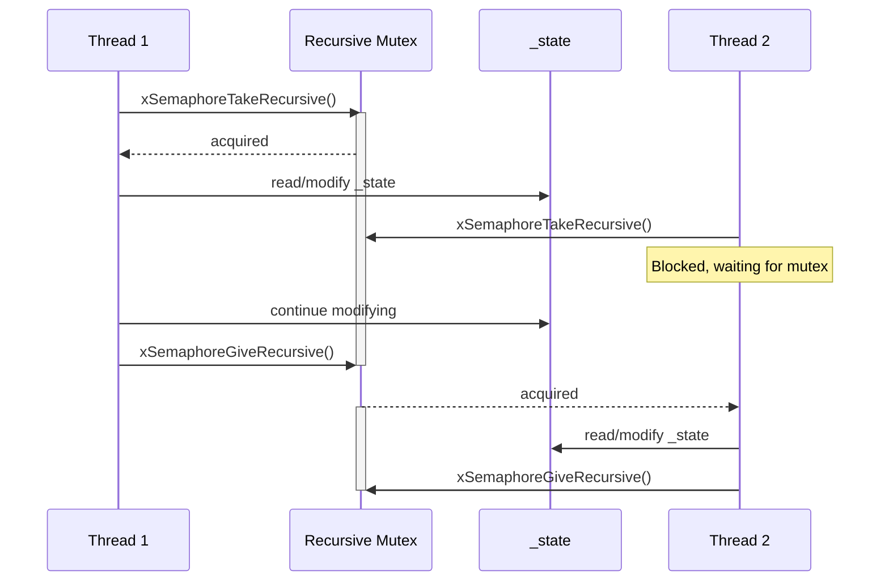
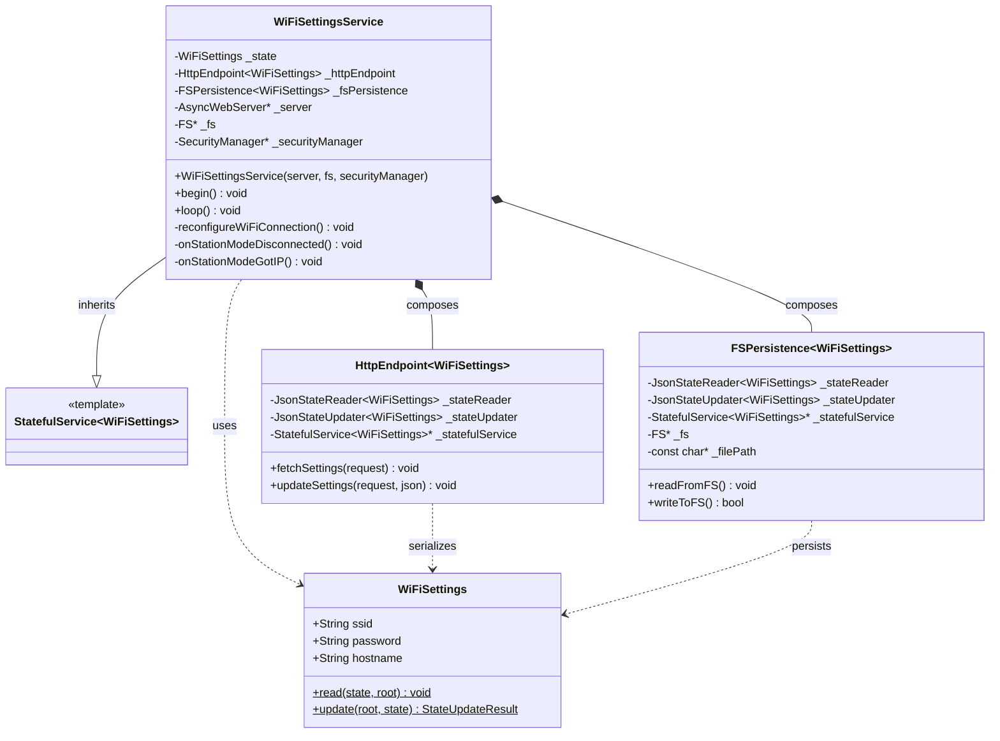
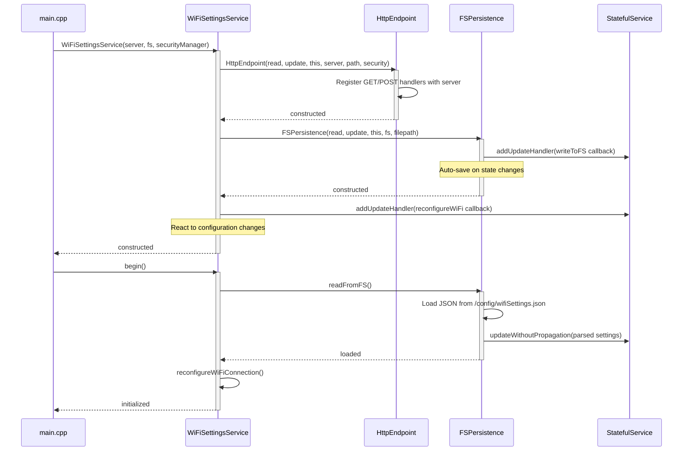
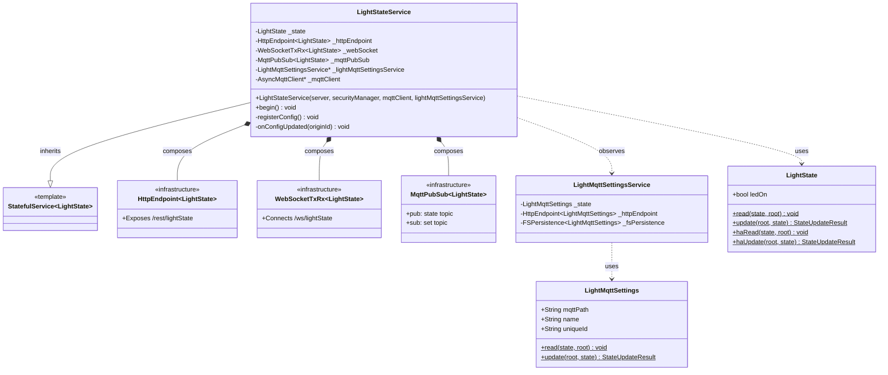
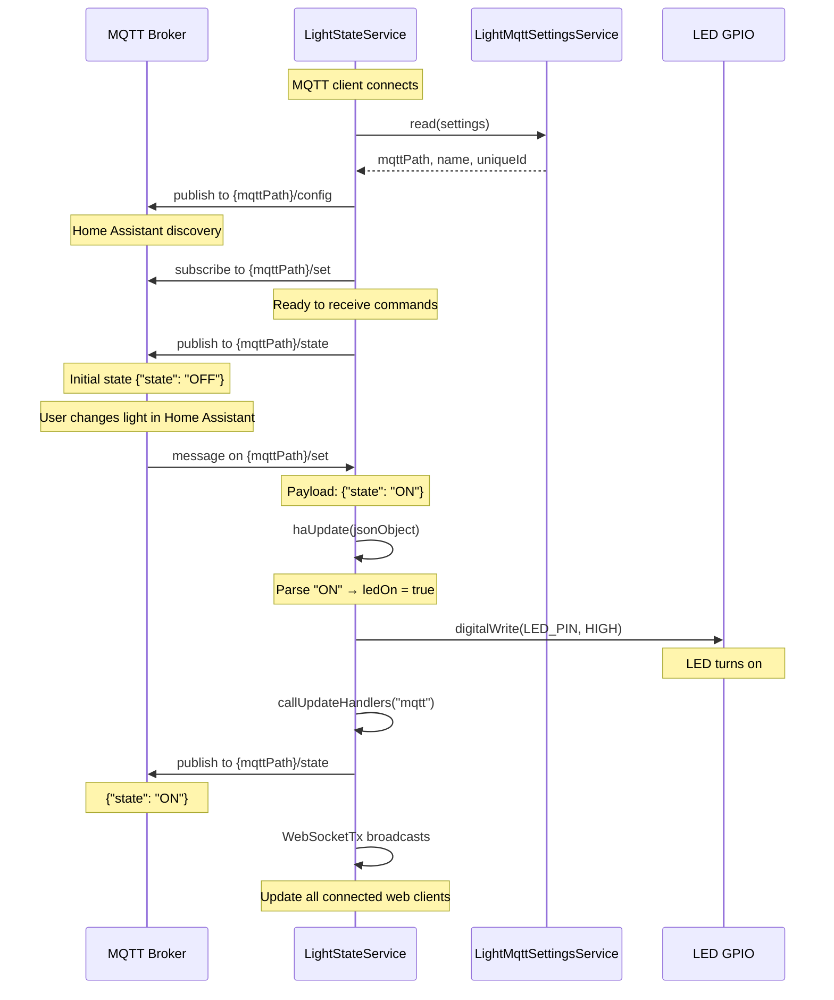
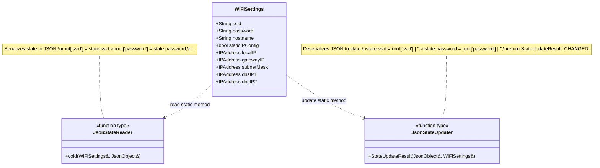
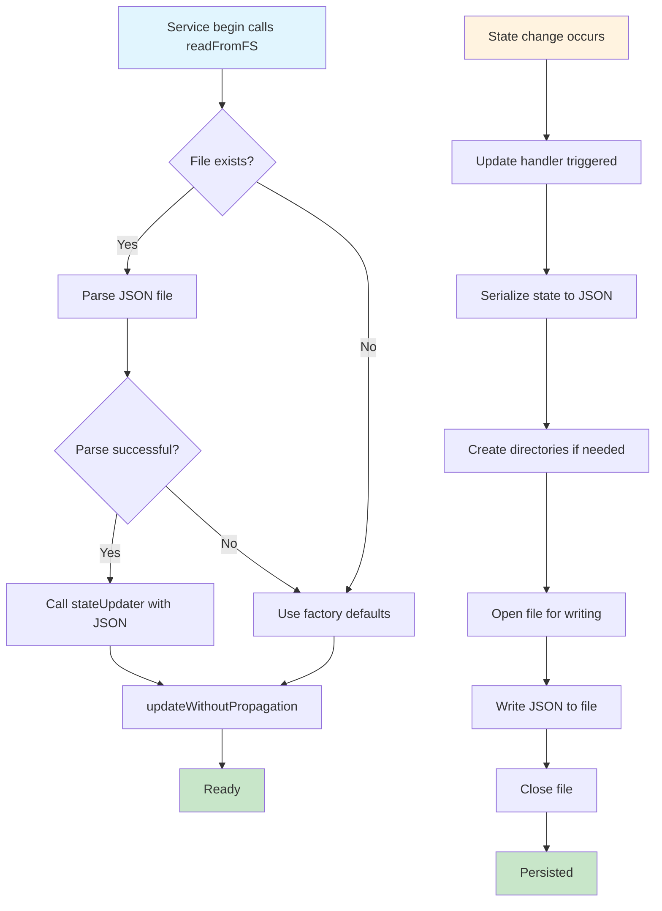

# C4 Model - Level 4: Code Patterns

## Overview

This document provides code-level diagrams and patterns (C4 Level 4) for the ESP8266-React framework. It shows implementation details, class structures, and detailed patterns that developers should follow when extending the framework.

## StatefulService Pattern

### Class Diagram



### Update Handler Flow

```mermaid
sequenceDiagram
    participant Client
    participant Service as StatefulService&lt;T&gt;
    participant Handler1 as FSPersistence
    participant Handler2 as WebSocketTx
    participant Handler3 as MqttPub
    
    Client->>Service: update(stateUpdater, "http")
    activate Service
    Service->>Service: beginTransaction()
    Service->>Service: stateUpdater(_state)
    Note over Service: State modified
    Service->>Service: endTransaction()
    
    alt StateUpdateResult::CHANGED
        Service->>Service: callUpdateHandlers("http")
        Service->>Handler1: callback("http")
        activate Handler1
        Handler1->>Handler1: writeToFS()
        Handler1-->>Service: done
        deactivate Handler1
        
        Service->>Handler2: callback("http")
        activate Handler2
        Handler2->>Handler2: transmitData(null, "http")
        Note over Handler2: Broadcast to WebSocket clients
        Handler2-->>Service: done
        deactivate Handler2
        
        Service->>Handler3: callback("http")
        activate Handler3
        Handler3->>Handler3: publish()
        Note over Handler3: Publish to MQTT broker
        Handler3-->>Service: done
        deactivate Handler3
    end
    
    Service-->>Client: StateUpdateResult::CHANGED
    deactivate Service
```

### Thread Safety (ESP32)



## Service Composition Pattern

### WiFiSettingsService Composition



### Constructor Initialization Pattern



## Demo Light Service Pattern

### LightStateService Architecture



### Home Assistant Integration Flow



## Serialization Pattern

### JsonStateReader and JsonStateUpdater



### WiFiSettings Serialization Example

```cpp
// JsonStateReader implementation
static void read(WiFiSettings& settings, JsonObject& root) {
    root["ssid"] = settings.ssid;
    root["password"] = settings.password;
    root["hostname"] = settings.hostname;
    root["static_ip_config"] = settings.staticIPConfig;
    
    if (settings.staticIPConfig) {
        root["local_ip"] = settings.localIP.toString();
        root["gateway_ip"] = settings.gatewayIP.toString();
        root["subnet_mask"] = settings.subnetMask.toString();
        root["dns_ip_1"] = settings.dnsIP1.toString();
        root["dns_ip_2"] = settings.dnsIP2.toString();
    }
}

// JsonStateUpdater implementation
static StateUpdateResult update(JsonObject& root, WiFiSettings& settings) {
    settings.ssid = root["ssid"] | "";
    settings.password = root["password"] | "";
    settings.hostname = root["hostname"] | SettingValue::format("#{platform}-#{unique_id}");
    settings.staticIPConfig = root["static_ip_config"] | false;
    
    if (settings.staticIPConfig) {
        settings.localIP.fromString(root["local_ip"] | "192.168.1.100");
        settings.gatewayIP.fromString(root["gateway_ip"] | "192.168.1.1");
        settings.subnetMask.fromString(root["subnet_mask"] | "255.255.255.0");
        settings.dnsIP1.fromString(root["dns_ip_1"] | "1.1.1.1");
        settings.dnsIP2.fromString(root["dns_ip_2"] | "8.8.8.8");
    }
    
    return StateUpdateResult::CHANGED;
}
```

## Origin Tracking Pattern

### Circular Update Prevention

```mermaid
flowchart TB
    Start[HTTP POST /rest/lightState] --> UpdateState[Update state with origin 'http']
    UpdateState --> CallHandlers[Call update handlers]
    
    CallHandlers --> FSPersist[FSPersistence handler]
    FSPersist --> WriteFile[Write to filesystem]
    
    CallHandlers --> WSHandler[WebSocketTx handler]
    WSHandler --> CheckOrigin{origin_id == 'websocket:{id}' ?}
    CheckOrigin -->|Yes| SkipWS[Skip this client]
    CheckOrigin -->|No| BroadcastWS[Broadcast to client]
    
    CallHandlers --> MQTTHandler[MqttPub handler]
    MQTTHandler --> Publish[Publish to MQTT broker]
    
    Publish --> ExternalMQTT[External system receives state]
    ExternalMQTT --> NoLoop[Does NOT send command back]
    
    WriteFile --> End[Done]
    SkipWS --> End
    BroadcastWS --> End
    
    style Start fill:#4fc3f7
    style CheckOrigin fill:#fff59d
    style SkipWS fill:#ffccbc
    style NoLoop fill:#c8e6c9
```

### Origin ID Usage

| Origin ID | Source | Propagation Behavior |
|-----------|--------|---------------------|
| `"http"` | REST API POST | Broadcast to WS, publish to MQTT, save to FS |
| `"mqtt"` | MQTT message | Broadcast to WS, save to FS (if configured), do NOT publish back to MQTT |
| `"websocket:{id}"` | WebSocket client | Broadcast to other WS clients (skip origin), publish to MQTT, save to FS |
| `"internal"` | Code initialization | Broadcast to all, publish to MQTT, save to FS |

## Infrastructure Component Patterns

### HttpEndpoint Pattern

```mermaid
sequenceDiagram
    participant Client as HTTP Client
    participant Server as AsyncWebServer
    participant Endpoint as HttpEndpoint&lt;T&gt;
    participant Security as SecurityManager
    participant Service as StatefulService&lt;T&gt;
    participant FS as Filesystem
    
    Note over Client,FS: GET Request Flow
    Client->>Server: GET /rest/wifiSettings
    Server->>Endpoint: fetchSettings(request)
    Endpoint->>Security: wrapRequest validates JWT
    alt Authorized
        Endpoint->>Service: read(jsonObject, stateReader)
        Service->>Service: _stateReader(_state, jsonObject)
        Service-->>Endpoint: JSON populated
        Endpoint-->>Client: 200 OK with JSON
    else Unauthorized
        Security-->>Client: 401 Unauthorized
    end
    
    Note over Client,FS: POST Request Flow
    Client->>Server: POST /rest/wifiSettings with JSON
    Server->>Endpoint: updateSettings(request, json)
    Endpoint->>Security: wrapCallback validates JWT
    alt Authorized
        Endpoint->>Service: updateWithoutPropagation(json, stateUpdater)
        Service->>Service: _stateUpdater(json, _state)
        Service-->>Endpoint: StateUpdateResult::CHANGED
        
        alt CHANGED
            Endpoint->>Endpoint: onDisconnect callback registered
            Note over Endpoint: Waits for response to be sent
            Endpoint-->>Client: 200 OK with updated JSON
            Note over Endpoint: Connection closed
            Endpoint->>Service: callUpdateHandlers("http")
            Service->>FS: FSPersistence writes to file
        else UNCHANGED
            Endpoint-->>Client: 200 OK with JSON
        else ERROR
            Endpoint-->>Client: 400 Bad Request
        end
    else Unauthorized
        Security-->>Client: 401 Unauthorized
    end
```

### FSPersistence Pattern



### MqttPubSub Pattern

```mermaid
sequenceDiagram
    participant Service as StatefulService&lt;T&gt;
    participant PubSub as MqttPubSub&lt;T&gt;
    participant Client as AsyncMqttClient
    participant Broker as MQTT Broker
    
    Note over Client,Broker: Connection Established
    Client->>PubSub: onConnect callback
    PubSub->>Client: subscribe(subTopic)
    PubSub->>Service: read state
    PubSub->>Client: publish(pubTopic, state)
    Client->>Broker: PUBLISH to pubTopic
    
    Note over Service,Broker: State Update (Internal)
    Service->>Service: State changes internally
    Service->>PubSub: Update handler triggered
    PubSub->>Service: read(jsonObject, stateReader)
    PubSub->>Client: publish(pubTopic, JSON)
    Client->>Broker: PUBLISH to pubTopic
    
    Note over Service,Broker: External Command
    Broker->>Client: PUBLISH to subTopic
    Client->>PubSub: onMessage(topic, payload)
    PubSub->>PubSub: Parse JSON payload
    PubSub->>Service: update(jsonObject, stateUpdater, "mqtt")
    Service->>Service: State updated
    Service->>PubSub: Update handler (different one)
    Note over PubSub: Does NOT publish back (origin="mqtt")
```

### WebSocketTxRx Pattern

```mermaid
sequenceDiagram
    participant Client as Browser WebSocket
    participant Server as AsyncWebSocket
    participant TxRx as WebSocketTxRx&lt;T&gt;
    participant Service as StatefulService&lt;T&gt;
    
    Note over Client,Service: Connection Flow
    Client->>Server: WebSocket upgrade
    Server->>TxRx: onWSEvent(WS_EVT_CONNECT)
    TxRx->>Client: Send client ID {"type":"id","id":"websocket:123"}
    TxRx->>Service: read current state
    TxRx->>Client: Send payload {"type":"payload","payload":{...}}
    
    Note over Client,Service: Client Sends Update
    Client->>Server: Send JSON message
    Server->>TxRx: onWSEvent(WS_EVT_DATA)
    TxRx->>TxRx: Parse JSON
    TxRx->>Service: update(json, stateUpdater, "websocket:123")
    Service->>Service: State updated
    Service->>TxRx: Update handler triggered
    TxRx->>TxRx: Check origin != "websocket:123"
    TxRx->>Server: Broadcast to OTHER clients
    Server->>Client: Other clients receive update
    
    Note over Client,Service: External Update (HTTP)
    Service->>Service: HTTP POST updates state
    Service->>TxRx: Update handler ("http" origin)
    TxRx->>Server: Broadcast to ALL clients
    Server->>Client: All clients receive update
```

## Best Practices

### 1. State Update Results

Always return appropriate result:

```cpp
StateUpdateResult update(JsonObject& root, Settings& settings) {
    bool changed = false;
    
    String newSSID = root["ssid"] | "";
    if (settings.ssid != newSSID) {
        settings.ssid = newSSID;
        changed = true;
    }
    
    return changed ? StateUpdateResult::CHANGED : StateUpdateResult::UNCHANGED;
}
```

### 2. Update Handler Registration

Register handlers with appropriate `allowRemove` flag:

```cpp
// Infrastructure handlers: allowRemove = false (permanent)
_statefulService->addUpdateHandler([&](const String& originId) { 
    writeToFS(); 
}, false);

// User handlers: allowRemove = true (default)
_statefulService->addUpdateHandler([&](const String& originId) { 
    reconfigureHardware(); 
});
```

### 3. Origin Checking

Check origin before acting:

```cpp
void onUpdate(const String& originId) {
    // Don't re-publish if origin is MQTT
    if (originId != "mqtt") {
        _mqttClient->publish(topic, payload);
    }
}
```

### 4. Thread-Safe State Access

Always use read/update methods (never access `_state` directly):

```cpp
// CORRECT
_statefulService->read([&](Settings& settings) {
    digitalWrite(LED_PIN, settings.ledOn ? HIGH : LOW);
});

// WRONG (not thread-safe on ESP32)
digitalWrite(LED_PIN, _statefulService->_state.ledOn ? HIGH : LOW);
```

### 5. Composition Over Inheritance

Compose infrastructure components:

```cpp
class MyService : public StatefulService<MySettings> {
    HttpEndpoint<MySettings> _httpEndpoint;      // REST API
    FSPersistence<MySettings> _fsPersistence;    // Persistence
    WebSocketTxRx<MySettings> _webSocket;        // Real-time
    MqttPubSub<MySettings> _mqttPubSub;          // MQTT
};
```

## Next Steps

- [SEQUENCE-DIAGRAMS.md](SEQUENCE-DIAGRAMS.md) - Detailed interaction flows
- [DESIGN-PATTERNS.md](DESIGN-PATTERNS.md) - Complete pattern catalog
- [EXTENSION-GUIDE.md](EXTENSION-GUIDE.md) - Implement these patterns
