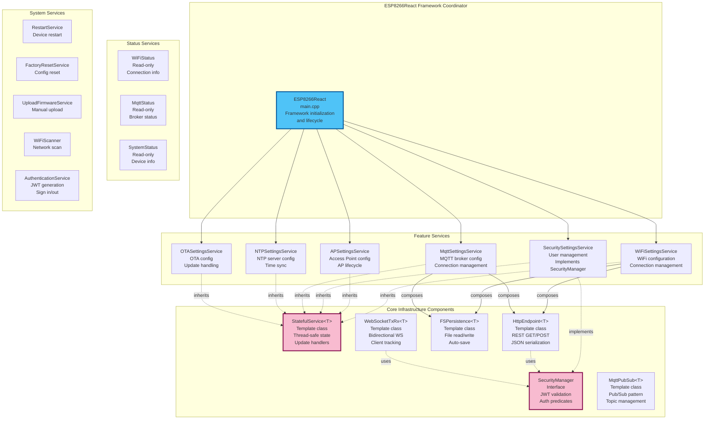

# C4 Model - Level 3: Backend Component Diagram

## Overview

This document provides detailed component diagrams (C4 Level 3) for the ESP8266-React framework backend. It shows the internal structure of the C++ backend, component relationships, and design patterns.

## Backend Component Overview



## Core Infrastructure Components

### 1. StatefulService<T>

**File**: `lib/framework/StatefulService.h`, `StatefulService.cpp`

**Type**: Template Class

**Purpose**: Base class for all services that manage state

**Template Parameter**: `T` - The state class (e.g., WiFiSettings, MqttSettings)

**Key Methods**:

```cpp
// Update state with propagation
StateUpdateResult update(
    std::function<StateUpdateResult(T&)> stateUpdater, 
    const String& originId
);

// Update without triggering handlers
StateUpdateResult updateWithoutPropagation(
    std::function<StateUpdateResult(T&)> stateUpdater
);

// Read state safely
void read(std::function<void(T&)> stateReader);

// JSON variants
StateUpdateResult update(JsonObject& jsonObject, JsonStateUpdater<T> stateUpdater, const String& originId);
void read(JsonObject& jsonObject, JsonStateReader<T> stateReader);

// Handler management
update_handler_id_t addUpdateHandler(StateUpdateCallback cb, bool allowRemove = true);
void removeUpdateHandler(update_handler_id_t id);
void callUpdateHandlers(const String& originId);
```

**State Update Results**:
- `StateUpdateResult::CHANGED` - State modified, propagate updates
- `StateUpdateResult::UNCHANGED` - No changes, skip propagation
- `StateUpdateResult::ERROR` - Update failed, skip propagation

**Thread Safety**:
- ESP32: Uses recursive mutex (`xSemaphoreCreateRecursiveMutex`)
- ESP8266: No mutex (single-threaded)
- All state access wrapped in `beginTransaction()`/`endTransaction()`

**Update Handler Pattern**:
```cpp
// Handlers stored in std::list
std::list<StateUpdateHandlerInfo_t> _updateHandlers;

// Each handler has:
struct StateUpdateHandlerInfo {
    update_handler_id_t _id;           // Unique ID
    StateUpdateCallback _cb;            // Callback function
    bool _allowRemove;                  // Can be removed?
};
```

**Usage Example**:
```cpp
class WiFiSettings {
    String ssid;
    String password;
};

class WiFiSettingsService : public StatefulService<WiFiSettings> {
    // Service implementation
};
```

### 2. HttpEndpoint<T>

**File**: `lib/framework/HttpEndpoint.h`

**Type**: Template Class (three variants)

**Purpose**: Expose StatefulService via REST API

**Variants**:

1. **HttpGetEndpoint<T>** - GET only
2. **HttpPostEndpoint<T>** - POST only
3. **HttpEndpoint<T>** - Both GET and POST (inherits from both)

**Template Parameter**: `T` - The state class

**Constructor Parameters**:
```cpp
HttpEndpoint(
    JsonStateReader<T> stateReader,      // Serialize state to JSON
    JsonStateUpdater<T> stateUpdater,    // Deserialize JSON to state
    StatefulService<T>* statefulService, // Service to expose
    AsyncWebServer* server,              // Web server instance
    const String& servicePath,           // URL path (e.g., "/rest/wifiSettings")
    SecurityManager* securityManager,    // For authentication (optional)
    AuthenticationPredicate authPredicate = AuthenticationPredicates::IS_ADMIN,
    size_t bufferSize = DEFAULT_BUFFER_SIZE
);
```

**GET Flow**:
1. Request received on configured path
2. Security check (if SecurityManager provided)
3. Create AsyncJsonResponse
4. Call `stateReader` to serialize state
5. Send JSON response

**POST Flow**:
1. Parse JSON body (AsyncCallbackJsonWebHandler)
2. Security check (if SecurityManager provided)
3. Call `updateWithoutPropagation()` with `stateUpdater`
4. If CHANGED: Schedule `callUpdateHandlers()` on disconnect
5. Serialize updated state and return

**Origin ID**: "http"

**Security**:
- Optional SecurityManager parameter
- AuthenticationPredicate controls access level
- Request wrapping: `securityManager->wrapRequest(...)`

**Example**:
```cpp
HttpEndpoint<WiFiSettings> _httpEndpoint(
    WiFiSettings::read,           // JsonStateReader
    WiFiSettings::update,         // JsonStateUpdater
    this,                         // StatefulService pointer
    server,                       // AsyncWebServer
    "/rest/wifiSettings",         // Path
    securityManager,              // SecurityManager
    AuthenticationPredicates::IS_ADMIN
);
```

### 3. FSPersistence<T>

**File**: `lib/framework/FSPersistence.h`

**Type**: Template Class

**Purpose**: Persist StatefulService state to filesystem

**Template Parameter**: `T` - The state class

**Constructor Parameters**:
```cpp
FSPersistence(
    JsonStateReader<T> stateReader,      // Serialize to JSON
    JsonStateUpdater<T> stateUpdater,    // Deserialize from JSON
    StatefulService<T>* statefulService, // Service to persist
    FS* fs,                              // Filesystem (LittleFS)
    const char* filePath,                // e.g., "/config/wifiSettings.json"
    size_t bufferSize = DEFAULT_BUFFER_SIZE
);
```

**Key Methods**:
```cpp
void readFromFS();           // Load from file
bool writeToFS();            // Save to file
void enableUpdateHandler();  // Auto-save on state changes
void disableUpdateHandler(); // Manual save only
```

**Read Flow**:
1. Open file for reading
2. Parse JSON (ArduinoJson)
3. Call `updateWithoutPropagation()` with parsed data
4. If file missing or parse error: apply defaults

**Write Flow**:
1. Create JSON document
2. Call `stateReader` to serialize state
3. Create directories if needed (`mkdirs()`)
4. Open file for writing
5. Serialize JSON to file
6. Close file

**Auto-Save**:
- Registers update handler in constructor
- Writes to filesystem on every state change
- Can be disabled for manual control

**Directory Creation**:
```cpp
// Automatically creates parent directories
// E.g., for "/config/wifi/settings.json":
// Creates /config/, then /config/wifi/
void mkdirs();
```

**Example**:
```cpp
FSPersistence<WiFiSettings> _fsPersistence(
    WiFiSettings::read,
    WiFiSettings::update,
    this,
    fs,
    "/config/wifiSettings.json"
);
```

### 4. WebSocketTxRx<T>

**File**: `lib/framework/WebSocketTxRx.h`

**Type**: Template Class (three variants)

**Purpose**: Real-time bidirectional communication

**Variants**:
1. **WebSocketTx<T>** - Transmit only
2. **WebSocketRx<T>** - Receive only
3. **WebSocketTxRx<T>** - Both (inherits from both)

**Template Parameter**: `T` - The state class

**Constructor Parameters**:
```cpp
WebSocketTxRx(
    JsonStateReader<T> stateReader,
    JsonStateUpdater<T> stateUpdater,
    StatefulService<T>* statefulService,
    AsyncWebServer* server,
    const char* webSocketPath,           // e.g., "/ws/lightState"
    SecurityManager* securityManager,    // Optional
    AuthenticationPredicate authPredicate = AuthenticationPredicates::IS_ADMIN,
    size_t bufferSize = DEFAULT_BUFFER_SIZE
);
```

**Client ID Tracking**:
- Each client assigned unique ID: "websocket:{clientId}"
- ID message sent on connection:
  ```json
  {"type": "id", "id": "websocket:12345"}
  ```

**Transmit (Tx) Flow**:
1. State change occurs
2. Update handler triggered
3. Create payload message:
   ```json
   {
     "type": "payload",
     "origin_id": "http",
     "payload": { /* state data */ }
   }
   ```
4. Broadcast to all clients except origin

**Receive (Rx) Flow**:
1. Client sends JSON message
2. Parse message
3. Call `update()` with client ID as origin
4. Update handlers propagate to other clients

**Origin ID**: "websocket:{clientId}"

**Connection Events**:
- **WS_EVT_CONNECT**: Send client ID, send current state
- **WS_EVT_DATA**: Parse and process update

**Security**: WebSocket filter applied at connection time

**Example**:
```cpp
WebSocketTxRx<LightState> _webSocket(
    LightState::read,
    LightState::update,
    this,
    server,
    "/ws/lightState",
    securityManager
);
```

### 5. MqttPubSub<T>

**File**: `lib/framework/MqttPubSub.h`

**Type**: Template Class (three variants)

**Purpose**: MQTT pub/sub integration

**Variants**:
1. **MqttPub<T>** - Publish only
2. **MqttSub<T>** - Subscribe only
3. **MqttPubSub<T>** - Both (inherits from both)

**Template Parameter**: `T` - The state class

**Constructor Parameters**:
```cpp
MqttPubSub(
    JsonStateReader<T> stateReader,
    JsonStateUpdater<T> stateUpdater,
    StatefulService<T>* statefulService,
    AsyncMqttClient* mqttClient,
    const String& pubTopic = "",        // State topic
    const String& subTopic = "",        // Command topic
    bool retain = false,
    size_t bufferSize = DEFAULT_BUFFER_SIZE
);
```

**Publish (Pub) Flow**:
1. State change occurs
2. Update handler triggered
3. Serialize state to JSON
4. Publish to pubTopic with retain flag

**Subscribe (Sub) Flow**:
1. On MQTT connect, subscribe to subTopic
2. On message received:
   - Filter by topic
   - Parse JSON
   - Call `update()` with origin "mqtt"

**Topic Reconfiguration**:
```cpp
void configureTopics(const String& pubTopic, const String& subTopic);
```

**Origin ID**: "mqtt"

**QoS**: Configurable (default 0 for pub, 2 for sub)

**Retain**: Configurable per topic

**Example**:
```cpp
MqttPubSub<LightState> _mqttPubSub(
    LightState::read,
    LightState::update,
    this,
    mqttClient,
    "homeassistant/light/esp_light/state",  // pub topic
    "homeassistant/light/esp_light/set"      // sub topic
);
```

### 6. SecurityManager

**File**: `lib/framework/SecurityManager.h`

**Type**: Abstract Interface

**Purpose**: Authentication and authorization

**Implemented By**: `SecuritySettingsService`

**Key Methods**:
```cpp
// Request wrapping
ArRequestHandlerFunction wrapRequest(
    ArRequestHandlerFunction onRequest,
    AuthenticationPredicate predicate
);

// Callback wrapping
ArJsonRequestHandlerFunction wrapCallback(
    ArJsonRequestHandlerFunction onRequest,
    AuthenticationPredicate predicate
);

// WebSocket filtering
AwsTemplateProcessor filterRequest(
    AwsTemplateProcessor processor
);
```

**Authentication Predicates**:
```cpp
namespace AuthenticationPredicates {
    // No authentication required
    const AuthenticationPredicate NONE_REQUIRED;
    
    // Any authenticated user
    const AuthenticationPredicate IS_AUTHENTICATED;
    
    // Admin role required
    const AuthenticationPredicate IS_ADMIN;
}
```

**JWT Validation**:
- Extract token from Authorization header
- Decode and verify signature
- Check expiration
- Extract user information

**User Model**:
```cpp
class User {
    String username;
    String password;  // Hashed
    bool admin;
};
```

## Feature Service Components

### WiFiSettingsService

**File**: `lib/framework/WiFiSettingsService.h/cpp`

**Purpose**: Manage WiFi station connection

**State Class**:
```cpp
class WiFiSettings {
    String ssid;
    String password;
    String hostname;
    bool staticIPConfig;
    IPAddress localIP;
    IPAddress gatewayIP;
    IPAddress subnetMask;
    IPAddress dnsIP1;
    IPAddress dnsIP2;
};
```

**Composition**:
- `HttpEndpoint<WiFiSettings>` at `/rest/wifiSettings`
- `FSPersistence<WiFiSettings>` to `/config/wifiSettings.json`
- Update handler for connection management

**Responsibilities**:
- Connect to WiFi network
- Monitor connection status
- Auto-reconnect on disconnect
- Apply hostname
- Configure static IP or DHCP

**Loop Method**:
- Check connection status
- Trigger reconnection if needed

### MqttSettingsService

**File**: `lib/framework/MqttSettingsService.h/cpp`

**Purpose**: Manage MQTT broker connection

**State Class**:
```cpp
class MqttSettings {
    bool enabled;
    String host;
    uint16_t port;
    String username;
    String password;
    String clientId;
    uint16_t keepAlive;
    bool cleanSession;
    uint16_t maxTopicLength;
};
```

**Composition**:
- `HttpEndpoint<MqttSettings>` at `/rest/mqttSettings`
- `FSPersistence<MqttSettings>` to `/config/mqttSettings.json`
- Manages `AsyncMqttClient` instance
- Update handler for reconnection

**Responsibilities**:
- Connect to MQTT broker
- Maintain connection
- Handle reconnection
- Expose MqttClient for service use

**Loop Method**:
- Check connection status
- Trigger reconnection if needed

### SecuritySettingsService

**File**: `lib/framework/SecuritySettingsService.h/cpp`

**Purpose**: User management and JWT generation

**Implements**: `SecurityManager` interface

**State Class**:
```cpp
class SecuritySettings {
    std::list<User> users;
    String jwtSecret;
};
```

**Composition**:
- `HttpEndpoint<SecuritySettings>` at `/rest/securitySettings` (admin only)
- `FSPersistence<SecuritySettings>` to `/config/securitySettings.json`

**Responsibilities**:
- Store user accounts
- Hash passwords
- Generate JWT tokens
- Validate JWT tokens
- Apply authentication predicates

**JWT Structure**:
```json
{
  "username": "admin",
  "admin": true,
  "exp": 1234567890
}
```

## System Service Components

### RestartService

**Purpose**: Trigger device restart

**Endpoint**: POST `/rest/restart`

**Security**: Admin only

**Implementation**: Calls `ESP.restart()` after response sent

### FactoryResetService

**Purpose**: Erase all configuration files

**Endpoint**: POST `/rest/factoryReset`

**Security**: Admin only

**Implementation**:
1. Delete all files in `/config/`
2. Trigger restart
3. Services reload with factory defaults

### WiFiScanner

**Purpose**: Scan for available WiFi networks

**Endpoint**: GET `/rest/scanNetworks`

**Security**: Admin only

**Response**:
```json
{
  "networks": [
    {"ssid": "MyWiFi", "rssi": -45, "encryption_type": 3, "bssid": "..."}
  ]
}
```

### AuthenticationService

**Purpose**: JWT generation and validation

**Endpoints**:
- POST `/rest/signIn` - Generate JWT
- GET `/rest/verifyAuthorization` - Validate JWT

**Sign In Flow**:
1. Receive credentials
2. Validate against SecuritySettings
3. Generate JWT with expiration
4. Return token and user info

## Status Service Components

**Pattern**: Read-only endpoints exposing runtime state

### WiFiStatus

**Endpoint**: GET `/rest/wifiStatus`

**Response**:
```json
{
  "status": "connected",
  "local_ip": "192.168.1.100",
  "mac_address": "...",
  "rssi": -45,
  "ssid": "MyWiFi",
  "bssid": "...",
  "channel": 6,
  "subnet_mask": "...",
  "gateway_ip": "...",
  "dns_ip_1": "..."
}
```

### MqttStatus

**Endpoint**: GET `/rest/mqttStatus`

**Response**:
```json
{
  "enabled": true,
  "connected": true,
  "client_id": "esp8266-123456"
}
```

### SystemStatus

**Endpoint**: GET `/rest/systemStatus`

**Response**:
```json
{
  "esp_platform": "esp8266",
  "max_alloc_heap": 32768,
  "psram_size": 0,
  "free_psram": 0,
  "cpu_freq_mhz": 160,
  "sketch_size": 524288,
  "free_sketch_space": 3670016,
  "sdk_version": "2.2.2-dev...",
  "flash_chip_size": 4194304,
  "flash_chip_speed": 40000000
}
```

## Component Interaction Patterns

### Service Initialization Pattern

```cpp
// In constructor
Service::Service(AsyncWebServer* server, FS* fs, SecurityManager* securityManager) :
    _httpEndpoint(Settings::read, Settings::update, this, server, "/rest/path", securityManager),
    _fsPersistence(Settings::read, Settings::update, this, fs, "/config/file.json")
{
    // Additional initialization
}

// In begin()
void Service::begin() {
    _fsPersistence.readFromFS();  // Load configuration
    // Apply configuration to hardware/SDK
}
```

### Update Propagation Pattern

```
HTTP POST → HttpEndpoint → updateWithoutPropagation()
                                    ↓
                          callUpdateHandlers("http")
                                    ↓
                        ┌───────────┴───────────┐
                        ↓                       ↓
                 FSPersistence             WebSocketTx
                 (save to file)         (broadcast to clients)
```

### Circular Update Prevention

```cpp
// Update origin is tracked
statefulService->update(jsonObject, updater, "http");
                                              ↑
                                          origin ID
                                              ↓
// WebSocketTx checks origin before broadcasting
if (originId != clientId(client)) {
    client->text(message);  // Only send to other clients
}
```

## Next Steps

- [C4-COMPONENT-FRONTEND.md](C4-COMPONENT-FRONTEND.md) - Frontend components
- [C4-CODE-PATTERNS.md](C4-CODE-PATTERNS.md) - Code-level patterns
- [DESIGN-PATTERNS.md](DESIGN-PATTERNS.md) - Pattern catalog
- [EXTENSION-GUIDE.md](EXTENSION-GUIDE.md) - Build custom services
