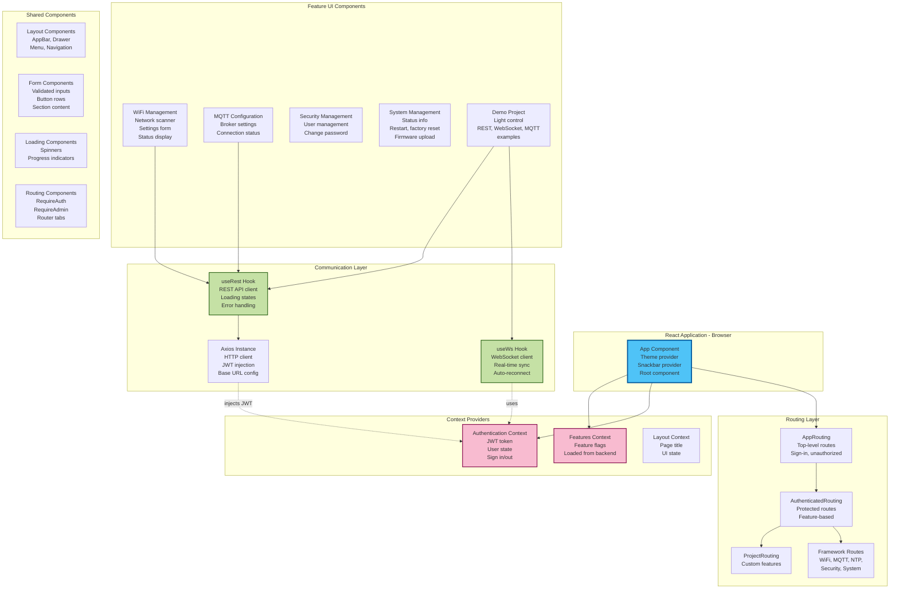

# C4 Model - Level 3: Frontend Component Diagram

## Overview

This document provides detailed component diagrams (C4 Level 3) for the React frontend of the ESP8266-React framework. It shows the internal structure of the single-page application, routing hierarchy, state management, and communication patterns.

## Frontend Component Overview



## Core Application Structure

### App Component

**File**: `interface/src/App.tsx`

**Purpose**: Root component, providers, and theming

**Structure**:
```tsx
<CustomTheme>
  <SnackbarProvider>
    <FeaturesLoader>
      <AppRouting />
    </FeaturesLoader>
  </SnackbarProvider>
</CustomTheme>
```

**Responsibilities**:
- Apply Material-UI theme
- Configure snackbar notifications (notistack)
- Load feature flags from backend
- Initialize routing

**Theme Configuration**: `interface/src/CustomTheme.tsx`
- Material-UI theme customization
- Typography, palette, spacing
- Responsive font sizes
- Dark/light mode support

### Main Entry Point

**File**: `interface/src/index.tsx`

**Structure**:
```tsx
<BrowserRouter>
  <App />
</BrowserRouter>
```

**Purpose**: Bootstrap React application with routing

## Context Providers

### 1. Features Context

**Files**: 
- `interface/src/contexts/features/FeaturesLoader.tsx`
- `interface/src/contexts/features/context.ts`

**Purpose**: Load and provide feature flags from backend

**State**:
```typescript
interface Features {
  project: boolean;
  security: boolean;
  mqtt: boolean;
  ntp: boolean;
  ota: boolean;
  upload_firmware: boolean;
}
```

**Loading Flow**:
1. Component mounts
2. Fetch `/rest/features`
3. Store in context state
4. Render children when loaded

**Usage**:
```typescript
const { features } = useContext(FeaturesContext);
if (features.mqtt) {
  // Show MQTT UI
}
```

**Purpose**: Conditionally render UI based on backend feature flags

### 2. Authentication Context

**Files**:
- `interface/src/contexts/authentication/Authentication.tsx`
- `interface/src/contexts/authentication/context.ts`

**Purpose**: Manage authentication state and JWT tokens

**State**:
```typescript
interface AuthenticationContext {
  me?: Me;  // Current user
  signIn(username: string, password: string, rememberMe?: boolean): Promise<void>;
  signOut(): void;
  refresh(): Promise<void>;
}

interface Me {
  username: string;
  admin: boolean;
}
```

**Token Storage**:
- `rememberMe=true`: localStorage (persistent)
- `rememberMe=false`: sessionStorage (session only)

**Initialization Flow**:
1. Component mounts
2. Check for existing token in storage
3. Verify token with `/rest/verifyAuthorization`
4. Extract user info from JWT
5. Update context state

**Sign In Flow**:
1. POST credentials to `/rest/signIn`
2. Receive JWT token and user info
3. Store token in storage
4. Update context state
5. Axios interceptor adds token to requests

**Security Fallback**:
- If `FT_SECURITY` disabled, context provides admin user without authentication

**Token Injection**:
```typescript
// Axios request interceptor
axios.interceptors.request.use(config => {
  const token = getToken();
  if (token) {
    config.headers.Authorization = `Bearer ${token}`;
  }
  return config;
});
```

### 3. Layout Context

**File**: `interface/src/components/layout/context.ts`

**Purpose**: Manage page title and UI state

**State**:
```typescript
interface LayoutContextValue {
  title: string;
}
```

**Usage**:
```typescript
const { setTitle } = useLayoutTitle("Page Title");
```

**Purpose**: Update app bar title dynamically

## Routing Hierarchy

### Level 1: AppRouting

**File**: `interface/src/AppRouting.tsx`

**Routes**:
```tsx
<Routes>
  <Route path="/unauthorized" element={<Redirect to="/" />} />
  <Route path="/firmwareUpdated" element={<FirmwareUpdateSuccess />} />
  <Route path="/" element={<SignIn />} />  // If security enabled
  <Route path="/*" element={<AuthenticatedRouting />} />
</Routes>
```

**Purpose**: 
- Handle unauthenticated routes
- Sign-in page (if security enabled)
- Delegate to authenticated routing

**Security Check**: Uses `RequireUnauthenticated` or `RequireAuthenticated` wrappers

### Level 2: AuthenticatedRouting

**File**: `interface/src/AuthenticatedRouting.tsx`

**Routes**:
```tsx
<Routes>
  {features.project && <Route path="/{PROJECT_PATH}/*" element={<ProjectRouting />} />}
  <Route path="/wifi/*" element={<WiFi />} />
  <Route path="/ap/*" element={<AccessPoint />} />
  {features.ntp && <Route path="/ntp/*" element={<NetworkTime />} />}
  {features.mqtt && <Route path="/mqtt/*" element={<Mqtt />} />}
  {features.security && <Route path="/security/*" element={<RequireAdmin><Security /></RequireAdmin>} />}
  <Route path="/system/*" element={<System />} />
  <Route path="/*" element={<Navigate to={defaultRoute()} />} />
</Routes>
```

**Purpose**:
- Feature-based routing
- Admin-only routes
- Default route resolution

**Layout**: Wrapped in `Layout` component (AppBar + Drawer + Content)

### Level 3: Feature Routing

**WiFi Management** (`interface/src/framework/wifi/WiFiConnection.tsx`):
```tsx
<RouterTabs>
  <Route path="status" element={<WiFiStatusForm />} />
  <Route path="settings" element={<WiFiSettingsForm />} />
</RouterTabs>
```

**MQTT** (`interface/src/framework/mqtt/Mqtt.tsx`):
```tsx
<RouterTabs>
  <Route path="status" element={<MqttStatusForm />} />
  <Route path="settings" element={<MqttSettingsForm />} />
</RouterTabs>
```

**System** (`interface/src/framework/system/System.tsx`):
```tsx
<RouterTabs>
  <Route path="status" element={<SystemStatusForm />} />
  <Route path="ota" element={<OTASettingsForm />} />
  <Route path="upload" element={<UploadFirmwareForm />} />
</RouterTabs>
```

### Level 4: Project Routing

**File**: `interface/src/project/ProjectRouting.tsx`

**Routes**:
```tsx
<Routes>
  <Route index element={<Navigate to="demo/information" />} />
  <Route path="demo/*" element={<DemoProject />} />
</Routes>
```

**Demo Project** (`interface/src/project/DemoProject.tsx`):
```tsx
<RouterTabs>
  <Route path="information" element={<DemoInformation />} />
  <Route path="rest" element={<LightStateRestForm />} />
  <Route path="socket" element={<LightStateWebSocketForm />} />
  <Route path="mqtt" element={<LightMqttSettingsForm />} />
</RouterTabs>
```

## Communication Layer

### useRest Hook

**File**: `interface/src/utils/useRest.ts`

**Purpose**: REST API state management

**Type Signature**:
```typescript
interface RestResult<D> {
  loadData: () => void;
  saveData: () => void;
  saving: boolean;
  data?: D;
  setData: (data: D) => void;
  errorMessage?: string;
}

function useRest<D>(
  endpoint: Endpoint<D>,
  initialData?: D
): RestResult<D>
```

**Features**:
- Automatic loading on mount
- Loading state management
- Error handling with snackbar
- Manual save trigger

**Usage Example**:
```typescript
const { loadData, saveData, saving, data, setData, errorMessage } = 
  useRest(WIFI_SETTINGS_ENDPOINT);

// data contains WiFiSettings
// setData updates local state
// saveData sends POST request
```

**Endpoints** (`interface/src/api/`):
- `wifi.ts` - WiFi endpoints
- `mqtt.ts` - MQTT endpoints
- `security.ts` - Security endpoints
- `system.ts` - System endpoints
- `project/api.ts` - Project endpoints

### useWs Hook

**File**: `interface/src/utils/useWs.ts`

**Purpose**: WebSocket real-time communication

**Type Signature**:
```typescript
interface WsResult<D> {
  data?: D;
  updateData: (data: D) => void;
  connected: boolean;
}

function useWs<D>(
  endpoint: string,
  initialData?: D,
  throttleMs = 100
): WsResult<D>
```

**Features**:
- Automatic reconnection (sockette)
- Client ID tracking (ignore own updates)
- Throttled transmission (debounce)
- Bidirectional sync

**Message Flow**:

**Receive**:
1. WebSocket message received
2. Parse JSON
3. Check `origin_id !== clientId`
4. Update local state
5. Trigger re-render

**Send**:
1. User updates UI
2. `updateData()` called
3. Throttle applied (100ms default)
4. Serialize to JSON
5. Send via WebSocket

**Usage Example**:
```typescript
const { data, updateData, connected } = 
  useWs("/ws/lightState", { led_on: false });

// data contains current state
// updateData sends to backend
// connected shows WebSocket status
```

### Axios Configuration

**File**: `interface/src/api/endpoints.ts`

**Base URL**: `/rest/`

**Interceptors**:
- **Request**: Inject JWT token from authentication context
- **Response**: Handle 401 (redirect to sign-in)

**Helper Functions**:
```typescript
function restEndpoint<T>(path: string): Endpoint<T>
function webSocketUrl(path: string): string
```

**File Upload**:
```typescript
function postUpload<T>(
  path: string, 
  file: File, 
  onProgress: (progress: number) => void
): Promise<AxiosResponse<T>>
```

## Feature UI Components

### WiFi Management

**Files**: `interface/src/framework/wifi/`

**Components**:

1. **WiFiConnection** - Tab container
2. **WiFiStatusForm** - Connection status display
   - SSID, IP address, RSSI, MAC
   - Connected/disconnected state
3. **WiFiSettingsForm** - Configuration form
   - SSID, password, hostname
   - Static IP or DHCP
   - Save button
4. **WiFiNetworkScanner** - Network scan results
   - SSID list with signal strength
   - Encryption type
   - Click to select
5. **WiFiNetworkSelector** - Scan + select workflow

**State Management**: 
- Settings: `useRest` for WiFiSettings
- Status: `useRest` for WiFiStatus (read-only)
- Scanner: Manual fetch trigger

### MQTT Configuration

**Files**: `interface/src/framework/mqtt/`

**Components**:

1. **Mqtt** - Tab container
2. **MqttStatusForm** - Connection status
   - Enabled/disabled
   - Connected/disconnected
   - Client ID
3. **MqttSettingsForm** - Broker configuration
   - Host, port
   - Username, password
   - Client ID, keep-alive
   - Clean session flag

**State Management**: 
- Settings: `useRest` for MqttSettings
- Status: `useRest` for MqttStatus (read-only, auto-refresh)

### Security Management

**Files**: `interface/src/framework/security/`

**Components**:

1. **Security** - Tab container (admin only)
2. **ManageUsersForm** - User list
   - Add/edit/delete users
   - Username, admin flag
3. **UserForm** - User edit dialog
   - Username, password, admin checkbox
4. **SecuritySettingsForm** - JWT settings
   - JWT secret (read-only, auto-generated)

**State Management**: `useRest` for SecuritySettings

**Admin Protection**: Wrapped in `RequireAdmin` component

### System Management

**Files**: `interface/src/framework/system/`

**Components**:

1. **System** - Tab container
2. **SystemStatusForm** - Device information
   - Platform, CPU frequency
   - Free heap, flash size
   - SDK version
3. **OTASettingsForm** - OTA configuration
   - Port, password, enabled flag
4. **UploadFirmwareForm** - Manual upload
   - File selector (drag-and-drop)
   - Upload progress
   - Firmware update monitor
5. **FirmwareRestartMonitor** - Post-update status
   - Waits for device restart
   - Confirms successful update

**State Management**:
- Status: `useRest` for SystemStatus (auto-refresh)
- OTA: `useRest` for OTASettings
- Upload: `useFileUpload` hook

### Demo Project UI

**Files**: `interface/src/project/`

**Components**:

1. **DemoInformation** - Documentation page
2. **LightStateRestForm** - REST API example
   - Checkbox for LED state
   - Manual load/save buttons
   - Uses `useRest`
3. **LightStateWebSocketForm** - WebSocket example
   - Switch for LED state
   - Real-time sync
   - Uses `useWs`
4. **LightMqttSettingsForm** - MQTT configuration
   - Unique ID, name, MQTT path
   - Uses `useRest`

**Data Types** (`interface/src/project/types.ts`):
```typescript
interface LightState {
  led_on: boolean;
}

interface LightMqttSettings {
  unique_id: string;
  name: string;
  mqtt_path: string;
}
```

## Shared Components

### Layout Components

**Files**: `interface/src/components/layout/`

**Components**:

1. **Layout** - Main layout wrapper
   - AppBar, Drawer, Content area
   - Responsive design
2. **LayoutAppBar** - Top bar
   - Title, menu button, auth menu
3. **LayoutDrawer** - Side navigation
   - Temporary (mobile) or permanent (desktop)
   - Menu items
4. **LayoutMenu** - Navigation items
   - Feature-based menu generation
5. **LayoutMenuItem** - Single menu item
   - Icon, label, link
6. **LayoutAuthMenu** - User menu
   - Username display
   - Sign out button (if security enabled)

### Form Components

**Files**: `interface/src/components/inputs/`

**Components**:

1. **ValidatedTextField** - Text input with validation
   - Material-UI TextField
   - async-validator integration
   - Error message display
2. **ValidatedPasswordField** - Password input
   - Show/hide password toggle
   - Validation support
3. **BlockFormControlLabel** - Checkbox/switch label
   - Full-width layout

**Files**: `interface/src/components/`

4. **ButtonRow** - Action button container
5. **SectionContent** - Page section wrapper
6. **MessageBox** - Info/warning/error display

### Loading Components

**Files**: `interface/src/components/loading/`

**Components**:

1. **LoadingSpinner** - Full-page spinner
2. **FormLoader** - Form-level loading indicator
3. **ApplicationError** - Error page

### Routing Components

**Files**: `interface/src/components/routing/`

**Components**:

1. **RequireAuthenticated** - Redirect if not logged in
2. **RequireUnauthenticated** - Redirect if logged in
3. **RequireAdmin** - Redirect if not admin
4. **RouterTabs** - Tab-based routing
   - Material-UI Tabs
   - Synced with React Router

**Hook**: `useRouterTab` - Tab state management

## State Management Strategy

### No Redux/MobX

**Approach**: React Context API + Custom Hooks

**Rationale**:
- Small to medium state complexity
- Context API sufficient for global state
- Custom hooks encapsulate logic
- Less boilerplate than Redux

### State Categories

1. **Global State** (Context):
   - Authentication (user, token)
   - Features (feature flags)
   - Layout (page title)

2. **Component State** (useState):
   - Form inputs
   - UI state (dialogs, menus)
   - Local data

3. **Server State** (useRest/useWs):
   - Configuration (WiFi, MQTT, etc.)
   - Status (connection state)
   - Real-time data

### Data Flow Patterns

**REST Pattern**:
```
Component → useRest → Axios → Backend
                ↓
          Local State
                ↓
          Re-render
```

**WebSocket Pattern**:
```
Component → useWs → WebSocket → Backend
    ↑                    ↓
    └─── Update ─────────┘
         (bidirectional)
```

**Context Pattern**:
```
Provider → Context → Consumer
             ↓
    createContext()
             ↓
    useContext()
```

## Form Validation

**Library**: async-validator

**Pattern**:
```typescript
const schema = new Schema({
  ssid: { required: true, max: 32 },
  password: { required: true, min: 8 }
});

schema.validate(formData, (errors) => {
  if (errors) {
    // Display errors
  } else {
    // Submit form
  }
});
```

**Validators** (`interface/src/validators/`):
- `wifi.ts` - WiFi validation rules
- `mqtt.ts` - MQTT validation rules
- `security.ts` - User validation rules
- `shared.ts` - Common rules (IP, port, etc.)

## Development vs Production

### Development Mode

**Proxy**: `interface/package.json`
```json
"proxy": "http://192.168.0.23"
```

**Setup Proxy**: `interface/src/setupProxy.js`
- Proxies REST requests
- Proxies WebSocket connections

**Dev Server**: `npm start` (port 3000)

**Hot Reload**: Changes reflect immediately

### Production Build

**Build**: `npm run build`

**Output**: `interface/build/` directory

**Optimization**:
- Minified JavaScript
- Gzipped assets
- No source maps
- Tree shaking

**Deployment**: 
- Option 1: Compiled into PROGMEM (C++ byte arrays)
- Option 2: Uploaded to LittleFS (`/www/` directory)

## Next Steps

- [C4-CODE-PATTERNS.md](C4-CODE-PATTERNS.md) - Code-level patterns
- [DATA-FLOWS.md](DATA-FLOWS.md) - Detailed data flows
- [API-REFERENCE.md](API-REFERENCE.md) - API contracts
- [EXTENSION-GUIDE.md](EXTENSION-GUIDE.md) - Build custom UI
