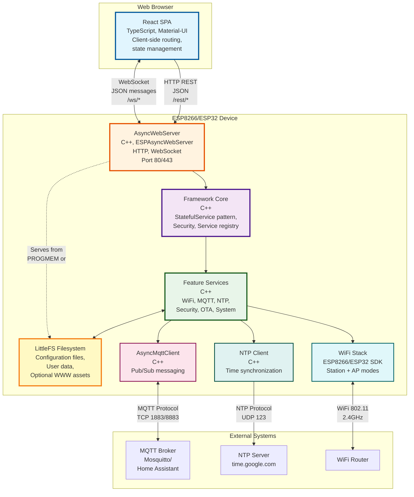

# C4 Model - Level 2: Container Diagram

## Overview

This document provides the Container diagram (C4 Level 2) for the ESP8266-React IoT framework. The Container diagram shows the high-level technology choices, how containers communicate, and where data is stored.

## Container Diagram



## Container Descriptions

### 1. React SPA (Single Page Application)

**Technology Stack**:
- React 18.1.0
- TypeScript 4.6.4
- Material-UI 5.8.0
- React Router 6.3.0
- Axios (HTTP client)
- Sockette (WebSocket client)

**Responsibilities**:
- Render responsive user interface
- Handle user interactions
- Manage client-side state (React Context + Hooks)
- Communicate with backend via REST and WebSocket
- Display real-time updates
- Client-side routing
- Form validation
- Error handling and notifications

**Key Features**:
- **Authentication UI**: Sign-in form, token management
- **WiFi Management**: Network scanner, connection settings
- **MQTT Configuration**: Broker settings, topic configuration
- **System Management**: Status display, restart, factory reset
- **Security Management**: User management (admin only)
- **Real-time Updates**: WebSocket integration for live data

**Build Process**:
- Compiled by react-scripts with react-app-rewired
- Gzipped for size optimization
- Source maps excluded in production
- Built by PlatformIO pre-build script (`scripts/build_interface.py`)

**Deployment**:
- **Option 1 (Default)**: Compiled into C++ byte arrays (PROGMEM_WWW)
- **Option 2**: Served from LittleFS filesystem (`/www/` directory)

**Size**: ~150KB (gzipped)

### 2. AsyncWebServer

**Technology Stack**:
- ESPAsyncWebServer library
- ESP8266WebServer / ESP32 WebServer SDK
- C++ (non-blocking, callback-based)

**Responsibilities**:
- Handle HTTP requests (GET, POST, OPTIONS)
- Manage WebSocket connections
- Route requests to handlers
- Apply CORS headers (if enabled)
- Serve static files (WWW assets)
- Handle authentication/authorization filters
- Manage connection limits

**Endpoints**:
- `/rest/*` - REST API endpoints
- `/ws/*` - WebSocket endpoints  
- `/` - Serves React application (index.html)
- `/js/*`, `/css/*`, `/fonts/*`, `/app/*` - Static assets

**Security**:
- JWT token validation via SecurityManager
- Request filtering callbacks
- WebSocket authentication predicates
- Optional CORS support

**Performance**:
- Async, non-blocking I/O
- Event-driven architecture
- Concurrent connection handling
- Buffer management for large payloads

**Port**: 80 (HTTP) or 443 (HTTPS with additional setup)

### 3. Framework Core

**Technology**: C++ templates and classes

**Location**: `lib/framework/`

**Key Classes**:
- `ESP8266React` - Main framework coordinator
- `StatefulService<T>` - State management template
- `SecurityManager` - Authentication and authorization interface
- `HttpEndpoint<T>` - REST API exposure
- `WebSocketTxRx<T>` - WebSocket bidirectional communication
- `MqttPubSub<T>` - MQTT pub/sub integration
- `FSPersistence<T>` - Filesystem persistence

**Responsibilities**:
- Initialize all framework services
- Provide accessor methods to services
- Coordinate service lifecycle (begin/loop)
- Manage shared resources (FS, SecurityManager, MqttClient)
- Register HTTP/WebSocket handlers
- Handle feature flag-based conditional compilation

**Initialization Flow**:
1. Mount filesystem (LittleFS)
2. Begin all enabled services
3. Register WWW routes
4. Services load configuration from filesystem

**Loop Flow**:
- Call loop() on services that need periodic execution
- WiFi management (connection monitoring)
- MQTT client maintenance
- OTA update processing

### 4. Feature Services

**Technology**: C++ classes inheriting from `StatefulService<T>`

**Location**: `lib/framework/` (framework services) and `src/` (custom services)

**Framework Services**:

1. **WiFiSettingsService** (`lib/framework/WiFiSettingsService.*`)
   - Manages WiFi station configuration
   - Connects to configured network
   - Monitors connection status
   - Persisted to `/config/wifiSettings.json`

2. **APSettingsService** (`lib/framework/APSettingsService.*`)
   - Configures Access Point mode
   - Controls when AP is enabled (always/on-disconnect)
   - Persisted to `/config/apSettings.json`

3. **SecuritySettingsService** (`lib/framework/SecuritySettingsService.*`)
   - User account management
   - JWT secret generation
   - Password hashing
   - Persisted to `/config/securitySettings.json`

4. **MqttSettingsService** (`lib/framework/MqttSettingsService.*`)
   - MQTT broker configuration
   - Connection management
   - Persisted to `/config/mqttSettings.json`

5. **NTPSettingsService** (`lib/framework/NTPSettingsService.*`)
   - NTP server configuration
   - Timezone settings
   - Time synchronization
   - Persisted to `/config/ntpSettings.json`

6. **OTASettingsService** (`lib/framework/OTASettingsService.*`)
   - OTA update configuration
   - Port and password settings
   - Persisted to `/config/otaSettings.json`

**Status Services** (read-only):
- WiFiStatus, APStatus, MqttStatus, NTPStatus, SystemStatus
- Expose current state via REST endpoints
- No persistence required

**System Services**:
- RestartService - Triggers device restart
- FactoryResetService - Erases configuration, restores defaults
- UploadFirmwareService - Manual firmware upload via HTTP

**Custom Services** (example in `src/`):
- LightStateService - Controls LED, integrates with MQTT
- LightMqttSettingsService - MQTT topic configuration for light

### 5. LittleFS Filesystem

**Technology**: LittleFS (Little Filesystem)

**Purpose**: Non-volatile storage for configuration and optional assets

**Partition**: Configurable in platformio.ini (typically 1-3MB)

**Directory Structure**:
```
/config/                      # Configuration files (JSON)
  ├── wifiSettings.json
  ├── apSettings.json
  ├── securitySettings.json
  ├── mqttSettings.json
  ├── ntpSettings.json
  ├── otaSettings.json
  └── brokerSettings.json     # Custom project settings
/www/                         # Optional: Frontend assets
  ├── index.html
  ├── js/*.js
  ├── css/*.css
  └── fonts/*
```

**Operations**:
- Read: Load configuration on service initialization
- Write: Save configuration on state updates (FSPersistence)
- Create: Automatic directory creation (mkdir)
- Format: Factory reset erases all files

**Access Pattern**:
- Synchronous file I/O (blocking)
- JSON serialization/deserialization
- Wear-leveling handled by LittleFS

**Factory Reset**:
- Deletes all files in `/config/`
- Triggers re-initialization with defaults
- Filesystem remains mounted

### 6. AsyncMqttClient

**Technology**: AsyncMqttClient library (async, non-blocking)

**Protocol**: MQTT v3.1.1 over TCP

**Responsibilities**:
- Connect to MQTT broker
- Maintain keep-alive connection
- Publish messages to topics
- Subscribe to topics
- Handle reconnection with exponential backoff
- Buffer outgoing messages

**Connection Parameters**:
- Host (IP or hostname)
- Port (1883 standard, 8883 for TLS)
- Client ID (supports placeholders)
- Username/password (optional)
- Keep-alive interval (default 60s)
- Clean session flag

**Integration**:
- Managed by MqttSettingsService
- Exposed via `ESP8266React::getMqttClient()`
- Used by MqttPubSub<T> for service integration

**Events**:
- onConnect - Triggers service registrations
- onDisconnect - Connection lost
- onMessage - Incoming message on subscribed topics

### 7. NTP Client

**Technology**: Built-in NTP client (ESP8266/ESP32 SDK)

**Protocol**: NTP over UDP (port 123)

**Responsibilities**:
- Query NTP server for current time
- Synchronize device RTC
- Apply timezone offset
- Handle daylight saving time

**Configuration**:
- Server hostname (e.g., time.google.com)
- Timezone label and POSIX format
- Sync interval (hourly by default)

**Integration**:
- Managed by NTPSettingsService
- Provides time to other services via SDK functions
- Status exposed via NTPStatus service

### 8. WiFi Stack

**Technology**: ESP8266/ESP32 WiFi SDK

**Modes**:
1. **Station (STA)** - Client mode, connects to existing WiFi
2. **Access Point (AP)** - Creates WiFi network
3. **STA+AP** - Both modes simultaneously

**Responsibilities**:
- Scan for available networks
- Connect to configured SSID
- Maintain connection with auto-reconnect
- Create access point
- Handle DHCP server (AP mode)
- Handle DHCP client (STA mode)

**Integration**:
- Managed by WiFiSettingsService and APSettingsService
- Status exposed via WiFiStatus and APStatus
- Network scanning via WiFiScanner

**Connection Management**:
- Automatic reconnection on disconnect
- Fallback to AP mode (if configured)
- Connection timeout handling

## Communication Protocols

### REST API (HTTP/HTTPS)

**Protocol**: HTTP/1.1

**Base Path**: `/rest/`

**Content Type**: `application/json`

**Authentication**: 
- Bearer token in Authorization header
- JWT format: `eyJ0eXAi...`
- Optional per endpoint (configured via AuthenticationPredicate)

**Request Flow**:
1. Browser sends HTTP request
2. WebServer receives and routes to handler
3. SecurityManager validates JWT (if required)
4. HttpEndpoint deserializes JSON
5. StatefulService updates state
6. HttpEndpoint serializes response
7. WebServer sends response

**Response Codes**:
- 200 - Success
- 400 - Bad request (invalid JSON)
- 401 - Unauthorized (missing/invalid token)
- 403 - Forbidden (insufficient permissions)
- 404 - Not found
- 500 - Internal server error

### WebSocket

**Protocol**: WebSocket (RFC 6455)

**Base Path**: `/ws/`

**Connection**:
1. HTTP upgrade request
2. SecurityManager filters connection (if required)
3. Connection established
4. Server sends client ID
5. Bidirectional message exchange

**Message Format**:
```json
{
  "type": "id",
  "id": "websocket:12345"
}
```
```json
{
  "type": "payload",
  "origin_id": "http",
  "payload": { /* state data */ }
}
```

**Update Flow**:
1. State changes in service
2. Update handlers triggered
3. WebSocketTx serializes state
4. Broadcast to all connected clients (except origin)
5. Clients update UI

**Client Tracking**:
- Each client assigned unique ID
- Origin ID sent with updates
- Clients ignore their own updates

### MQTT

**Protocol**: MQTT v3.1.1 over TCP

**Direction**: Bidirectional (Pub/Sub)

**QoS Levels**: 0 (at most once), 1 (at least once), 2 (exactly once)

**Flow**:
1. Device connects to broker
2. Device subscribes to command topics
3. Device publishes state to state topics
4. External systems publish commands
5. Device receives and processes commands

**Home Assistant Integration**:
- Discovery config published to `{basePath}/config`
- State updates to `{basePath}/state`
- Commands received on `{basePath}/set`

### Filesystem I/O

**Pattern**: Synchronous file operations

**Read Flow**:
1. Service calls FSPersistence::readFromFS()
2. Open file for reading
3. Deserialize JSON
4. Update state via JsonStateUpdater
5. Apply defaults if file missing

**Write Flow**:
1. State update occurs
2. Update handler triggered
3. FSPersistence::writeToFS() called
4. Serialize state to JSON
5. Write to file
6. Close file

## Data Flow

### Configuration Update Flow

```
Browser → REST POST → WebServer → HttpEndpoint → StatefulService
                                                        ↓
                                                   Update Handlers:
                                                   - FSPersistence (saves to FS)
                                                   - WebSocketTx (broadcasts)
                                                   - MqttPub (publishes)
```

### Real-Time Update Flow

```
External Event → Service → StatefulService → Update Handlers
                                                   ↓
                                        - WebSocketTx (all clients)
                                        - MqttPub (broker)
```

### MQTT Command Flow

```
MQTT Broker → MQTTClient → MqttSub → StatefulService → Update Handlers
                                                              ↓
                                                   - Hardware control
                                                   - WebSocketTx
                                                   - FSPersistence (if configured)
```

## Container Responsibilities Summary

| Container | Primary Responsibility | Technology | Persistent? |
|-----------|----------------------|------------|-------------|
| React SPA | User Interface | TypeScript + React | No (client-side only) |
| AsyncWebServer | HTTP/WebSocket Routing | C++ ESPAsyncWebServer | No |
| Framework Core | Service Coordination | C++ Templates | No |
| Feature Services | Business Logic | C++ StatefulService | Yes (via FSPersistence) |
| LittleFS | Configuration Storage | LittleFS | Yes |
| AsyncMqttClient | MQTT Communication | C++ AsyncMqttClient | No |
| NTP Client | Time Synchronization | ESP SDK | No |
| WiFi Stack | Network Connectivity | ESP SDK | No |

## Deployment Configuration

### PROGMEM WWW Mode (Default)
```
[React Build] → [Gzip] → [Byte Arrays] → [Compiled into Firmware] → [PROGMEM]
                                                ↓
                                         AsyncWebServer serves from PROGMEM
```

### Filesystem WWW Mode
```
[React Build] → [Gzip] → [Copy to data/] → [Upload to LittleFS] → [/www/ directory]
                                                ↓
                                         AsyncWebServer serves from FS
```

## Scalability and Limits

### Memory Constraints
- **Flash**: 512KB-4MB (depends on board)
- **RAM**: 80KB (ESP8266) / 520KB (ESP32)
- **Heap**: ~40-50KB available for framework + app

### Connection Limits
- **WebSocket**: 4-5 concurrent clients
- **HTTP**: Limited by async server queue
- **MQTT**: Single connection to broker

### Performance
- **Request Latency**: <50ms (typical REST request)
- **WebSocket Latency**: <10ms (local network)
- **MQTT Latency**: Network dependent

## Next Steps

- [C4-COMPONENT-BACKEND.md](C4-COMPONENT-BACKEND.md) - Backend component details
- [C4-COMPONENT-FRONTEND.md](C4-COMPONENT-FRONTEND.md) - Frontend component details
- [DATA-FLOWS.md](DATA-FLOWS.md) - Detailed data flow patterns
- [API-REFERENCE.md](API-REFERENCE.md) - Complete API documentation
