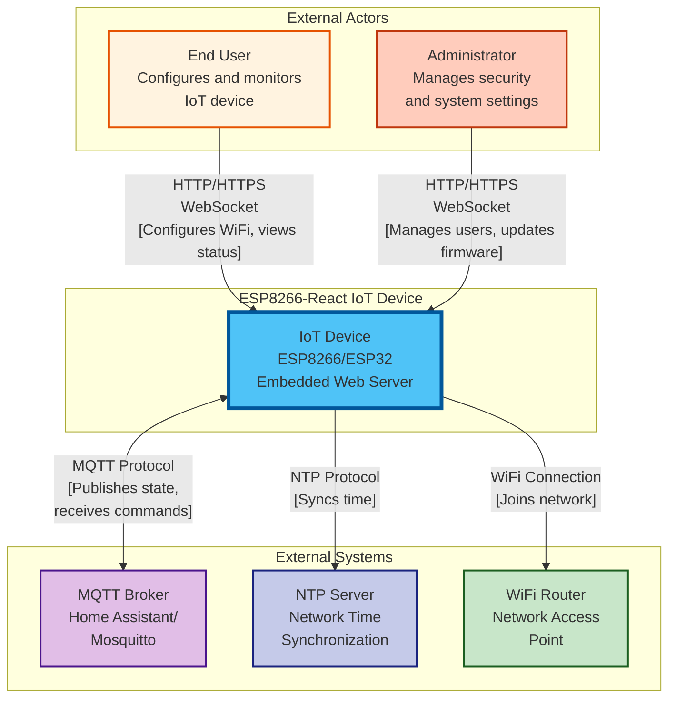

# C4 Model - Level 1: System Context

## Overview

This document provides the System Context diagram (C4 Level 1) for the ESP8266-React IoT framework. The System Context shows the system boundaries, external actors, and how the system fits into its environment.

## System Context Diagram



## System Description

### The IoT Device (ESP8266-React System)

**Purpose**: A configurable embedded web server running on ESP8266 or ESP32 microcontrollers that provides a responsive web interface for device management and custom IoT functionality.

**Key Responsibilities**:
- Hosts a React-based web application for configuration and monitoring
- Manages WiFi connectivity (station and access point modes)
- Provides secure authentication and authorization
- Integrates with MQTT brokers for home automation
- Synchronizes time via NTP
- Supports over-the-air firmware updates
- Exposes REST and WebSocket APIs for real-time communication

**Technology**: 
- C++ backend on Arduino framework
- React + TypeScript frontend
- LittleFS filesystem
- ESPAsyncWebServer for HTTP/WebSocket

## External Actors

### 1. End User

**Description**: Regular users who interact with the IoT device for day-to-day operations.

**Use Cases**:
- Configure WiFi network credentials
- Monitor device status (WiFi, MQTT, system info)
- Control IoT features (e.g., lights, sensors)
- View real-time data updates via WebSocket
- Access device through web browser on local network

**Access Level**: Authenticated user (guest or admin)

**Interaction Methods**:
- **HTTP REST API**: Configuration requests (GET/POST)
- **WebSocket**: Real-time status updates
- **Web Browser**: React-based UI for all interactions

### 2. Administrator

**Description**: Privileged users who manage security, system configuration, and firmware updates.

**Use Cases**:
- Manage user accounts and credentials
- Configure security settings (JWT secret)
- Upload and apply firmware updates
- Configure MQTT broker settings
- Configure NTP and timezone settings
- Perform factory resets
- Restart the device

**Access Level**: Admin role required

**Interaction Methods**:
- **HTTP REST API**: Administrative endpoints
- **WebSocket**: Real-time system status
- **Web Browser**: Admin-only UI sections

## External Systems

### 1. MQTT Broker

**Description**: Message broker that enables integration with home automation systems like Home Assistant.

**Examples**: 
- Mosquitto
- Home Assistant MQTT broker
- HiveMQ
- CloudMQTT

**Interaction Pattern**:
- **Protocol**: MQTT v3.1.1
- **Direction**: Bidirectional
- **Topics**:
  - `{basePath}/state` - Device publishes state updates
  - `{basePath}/set` - Device subscribes to commands
  - `{basePath}/config` - Home Assistant discovery

**Use Cases**:
- Publish device state changes to home automation
- Receive commands from automation rules
- Support Home Assistant auto-discovery
- Enable remote monitoring

**Configuration**:
- Broker hostname/IP
- Port (typically 1883 or 8883 for TLS)
- Optional authentication (username/password)
- Client ID (supports placeholders)
- Keep-alive interval
- Clean session flag

### 2. NTP Server

**Description**: Network Time Protocol server that provides accurate time synchronization.

**Examples**:
- time.google.com
- pool.ntp.org
- time.nist.gov

**Interaction Pattern**:
- **Protocol**: NTP (UDP port 123)
- **Direction**: Unidirectional (device queries server)
- **Frequency**: Periodic synchronization (default every hour)

**Use Cases**:
- Synchronize device clock on boot
- Maintain accurate timestamps for logs
- Schedule time-based automation
- Provide timezone-aware time display

**Configuration**:
- NTP server hostname
- Timezone label and POSIX format
- Sync interval
- Enable/disable flag

### 3. WiFi Router / Access Point

**Description**: Network infrastructure that provides internet connectivity and local network access.

**Interaction Pattern**:
- **Protocol**: WiFi 802.11 b/g/n (2.4GHz)
- **Mode**: Station mode (client) or AP mode (access point)
- **Security**: WPA/WPA2-PSK

**Use Cases**:
- **Station Mode**: Device connects to existing WiFi network
- **Access Point Mode**: Device creates its own WiFi network for configuration
- **Fallback Mode**: Automatically enables AP when station connection fails

**Configuration**:
- **Station Settings**:
  - SSID and password
  - Static IP or DHCP
  - Hostname
- **AP Settings**:
  - SSID and password
  - Channel (1-13)
  - IP address and subnet
  - Max clients
  - Hidden SSID option

## Communication Protocols

### HTTP/HTTPS (REST API)

**Direction**: Request-Response (Bidirectional)

**Endpoints**: `/rest/*`

**Methods**: GET, POST, OPTIONS

**Authentication**: 
- Bearer token (JWT) in Authorization header
- Optional (depends on endpoint security configuration)

**Content Type**: `application/json`

**Use Cases**:
- Read current configuration
- Update device settings
- Authenticate users
- Execute system commands (restart, factory reset)

### WebSocket

**Direction**: Bidirectional (Real-time)

**Endpoints**: `/ws/*`

**Protocol**: WebSocket (ws:// or wss://)

**Message Format**:
```json
{
  "type": "id" | "payload",
  "id": "websocket:12345",
  "origin_id": "mqtt" | "http" | "websocket:{id}",
  "payload": { /* state data */ }
}
```

**Authentication**: 
- Query parameter or initial handshake
- Filter applied at connection time

**Use Cases**:
- Real-time state synchronization
- Live status updates
- Bidirectional control without polling
- Client ID tracking to prevent echo

### MQTT

**Direction**: Bidirectional (Pub/Sub)

**Protocol**: MQTT v3.1.1 over TCP

**QoS Levels**: 0, 1, 2 (configurable)

**Topics**:
- Custom prefix per feature
- Separate pub and sub topics
- Home Assistant discovery support

**Use Cases**:
- Integration with home automation
- Remote monitoring
- Command and control
- Multi-device coordination

### NTP

**Direction**: Unidirectional (Client to Server)

**Protocol**: NTP over UDP

**Port**: 123

**Use Cases**:
- Time synchronization on boot
- Periodic clock adjustment
- Timezone conversion

## System Boundaries

### Inside the System
- Web server (HTTP/WebSocket)
- Filesystem (configuration persistence)
- MQTT client
- NTP client
- WiFi management (station and AP)
- Security/authentication
- Application services (user-defined)

### Outside the System
- Web browsers (user interface)
- MQTT brokers (message routing)
- NTP servers (time source)
- WiFi infrastructure (network connectivity)
- End users (human actors)
- Administrators (privileged human actors)

## Network Topology

### Development Environment
```
[Developer PC] <--WiFi--> [Router] <--WiFi--> [ESP8266 Device]
                                                    |
                                          [Access Point Mode]
                                                    |
                                          [Mobile/Laptop for config]
```

### Production Environment
```
[Internet] <---> [Router/Firewall] <--WiFi--> [ESP8266 Device]
                       |                              |
                [MQTT Broker]                   [Local Clients]
                [NTP Server]
```

### Isolated Environment
```
[ESP8266 Device (AP Mode)] <--WiFi--> [Configuration Client]
No internet required for basic configuration
```

## Security Context

### Trust Boundaries

1. **External to Device**: All HTTP/WebSocket communication crosses this boundary
   - JWT authentication required (if FT_SECURITY enabled)
   - HTTPS/WSS recommended for sensitive deployments

2. **Device to MQTT Broker**: Optional authentication
   - Username/password supported
   - Consider TLS for production

3. **Device to NTP Server**: No authentication (public protocol)
   - Read-only, low security risk

### Security Considerations

1. **Default Credentials**: Change admin/guest passwords immediately
2. **JWT Secret**: Randomized on first boot, persisted to filesystem
3. **Network Exposure**: Device accessible on local network by default
4. **MQTT Security**: Configure broker authentication and TLS
5. **Firmware Updates**: Verify source and integrity (OTA password protection)

## Deployment Scenarios

### 1. Home Automation Hub
- Connected to home WiFi
- Integrated with Home Assistant via MQTT
- Controlled by family members
- Scheduled automation based on time

### 2. Standalone IoT Device
- Creates own access point
- No internet required
- Direct mobile app connection
- Isolated operation

### 3. Industrial Sensor Node
- Connected to enterprise WiFi
- MQTT to central monitoring system
- Admin-only access
- OTA updates from management server

### 4. Development/Testing
- Connected to dev network
- Hot-reload frontend development
- Direct serial console access
- Frequent firmware updates

## Scalability Considerations

### Single Device Constraints
- **Concurrent Connections**: ~4-5 WebSocket clients
- **HTTP Requests**: Limited by available memory
- **MQTT Messages**: AsyncMqttClient queue depth
- **Filesystem**: LittleFS partition size

### Multiple Device Architecture
- Each device independent
- MQTT broker coordinates state
- No direct device-to-device communication
- Scales horizontally (add more devices)

## Next Steps

- [C4-CONTAINER.md](C4-CONTAINER.md) - Dive into container architecture
- [SECURITY.md](SECURITY.md) - Detailed security architecture
- [API-REFERENCE.md](API-REFERENCE.md) - Complete API documentation
