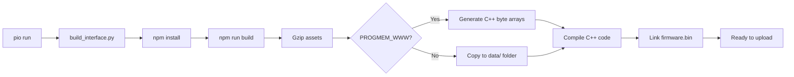

# Configuration Reference

## Overview

This document explains the build system, feature flags, and factory settings configuration for the ESP8266-React framework.

## Build System (PlatformIO)

### platformio.ini Structure

```ini
[platformio]
extra_configs = 
  factory_settings.ini    # Factory defaults
  features.ini            # Feature flags
default_envs = esp12e     # Target platform

[env]                     # Common settings
build_flags = ...
lib_deps = ...
framework = arduino
monitor_speed = 115200
extra_scripts = pre:scripts/build_interface.py

[env:esp12e]              # ESP8266 specific
platform = espressif8266
board = esp12e
board_build.f_cpu = 160000000L
board_build.filesystem = littlefs

[env:node32s]             # ESP32 specific
platform = espressif32
board = node32s
board_build.partitions = min_spiffs.csv
board_build.filesystem = littlefs
```

### Build Flags

**Common Flags**:
```ini
-D NO_GLOBAL_ARDUINOOTA     # Disable automatic OTA
-D PROGMEM_WWW              # Serve WWW from PROGMEM
-D ENABLE_CORS              # Enable CORS (optional)
-D CORS_ORIGIN=\"*\"        # CORS allowed origins
```

### Build Process



## Feature Flags (features.ini)

### Configuration

```ini
[features]
build_flags = 
  -D FT_PROJECT=1            # Enable project features
  -D FT_SECURITY=1           # Enable security/auth
  -D FT_MQTT=1               # Enable MQTT
  -D FT_NTP=1                # Enable NTP
  -D FT_OTA=1                # Enable OTA updates
  -D FT_UPLOAD_FIRMWARE=1    # Enable firmware upload
```

### Feature Descriptions

| Flag | Default | Description | Impact |
|------|---------|-------------|--------|
| `FT_PROJECT` | 1 | Project-specific UI | Shows/hides `/demo/` routes in UI |
| `FT_SECURITY` | 1 | Authentication & authorization | Removes sign-in, all endpoints public |
| `FT_MQTT` | 1 | MQTT broker integration | Removes MQTT client and endpoints |
| `FT_NTP` | 1 | Network time sync | Removes NTP service |
| `FT_OTA` | 1 | OTA update support | Removes OTA service |
| `FT_UPLOAD_FIRMWARE` | 1 | Manual firmware upload | Removes upload endpoint |

### Conditional Compilation

```cpp
#if FT_ENABLED(FT_MQTT)
    MqttSettingsService _mqttSettingsService;
    MqttStatus _mqttStatus;
#endif

#if FT_ENABLED(FT_SECURITY)
    AuthenticationService _authenticationService;
#endif
```

### Memory Savings

Disabling features saves flash and RAM:

| Feature Disabled | Flash Saved | RAM Saved |
|-----------------|-------------|-----------|
| FT_SECURITY | ~15KB | ~2KB |
| FT_MQTT | ~20KB | ~4KB |
| FT_NTP | ~5KB | ~1KB |
| FT_OTA | ~10KB | ~2KB |
| FT_UPLOAD_FIRMWARE | ~8KB | ~1KB |

## Factory Settings (factory_settings.ini)

### Placeholder Substitution

| Placeholder | Substituted Value | Example |
|-------------|-------------------|---------|
| `#{platform}` | "esp8266" or "esp32" | "esp8266" |
| `#{unique_id}` | MAC-derived hex | "0b0a859d6816" |
| `#{random}` | Random hex string | "55722f94" |

### WiFi Factory Settings

```ini
-D FACTORY_WIFI_SSID=\"\"                      # Empty = not configured
-D FACTORY_WIFI_PASSWORD=\"\"
-D FACTORY_WIFI_HOSTNAME=\"#{platform}-#{unique_id}\"
```

### Access Point Factory Settings

```ini
-D FACTORY_AP_PROVISION_MODE=AP_MODE_DISCONNECTED  # AP_MODE_ALWAYS | AP_MODE_DISCONNECTED | AP_MODE_NEVER
-D FACTORY_AP_SSID=\"ESP8266-React-#{unique_id}\"  # Unique per device
-D FACTORY_AP_PASSWORD=\"esp-react\"               # Change in production!
-D FACTORY_AP_CHANNEL=1
-D FACTORY_AP_SSID_HIDDEN=false
-D FACTORY_AP_MAX_CLIENTS=4
-D FACTORY_AP_LOCAL_IP=\"192.168.4.1\"
-D FACTORY_AP_GATEWAY_IP=\"192.168.4.1\"
-D FACTORY_AP_SUBNET_MASK=\"255.255.255.0\"
```

### Security Factory Settings

```ini
-D FACTORY_ADMIN_USERNAME=\"admin\"
-D FACTORY_ADMIN_PASSWORD=\"admin\"
-D FACTORY_GUEST_USERNAME=\"guest\"
-D FACTORY_GUEST_PASSWORD=\"guest\"
-D FACTORY_JWT_SECRET=\"#{random}-#{random}\"  # Randomized
```

**IMPORTANT**: Change default credentials in production!

### NTP Factory Settings

```ini
-D FACTORY_NTP_ENABLED=true
-D FACTORY_NTP_TIME_ZONE_LABEL=\"Europe/London\"
-D FACTORY_NTP_TIME_ZONE_FORMAT=\"GMT0BST,M3.5.0/1,M10.5.0\"
-D FACTORY_NTP_SERVER=\"time.google.com\"
```

### MQTT Factory Settings

```ini
-D FACTORY_MQTT_ENABLED=false                # Disabled by default
-D FACTORY_MQTT_HOST=\"test.mosquitto.org\"
-D FACTORY_MQTT_PORT=1883
-D FACTORY_MQTT_USERNAME=\"\"
-D FACTORY_MQTT_PASSWORD=\"\"
-D FACTORY_MQTT_CLIENT_ID=\"#{platform}-#{unique_id}\"
-D FACTORY_MQTT_KEEP_ALIVE=60
-D FACTORY_MQTT_CLEAN_SESSION=true
-D FACTORY_MQTT_MAX_TOPIC_LENGTH=128
```

### OTA Factory Settings

```ini
-D FACTORY_OTA_PORT=8266
-D FACTORY_OTA_PASSWORD=\"esp-react\"
-D FACTORY_OTA_ENABLED=true
```

## Platform-Specific Configuration

### ESP8266 (esp12e)

```ini
[env:esp12e]
platform = espressif8266
board = esp12e
board_build.f_cpu = 160000000L      # 160MHz
board_build.filesystem = littlefs
```

**Memory**:
- Flash: 4MB
- RAM: 80KB
- Available for code: ~1MB (after bootloader, SPIFFS)

### ESP32 (node32s)

```ini
[env:node32s]
board_build.partitions = min_spiffs.csv
platform = espressif32
board = node32s
board_build.filesystem = littlefs
```

**Partitions** (min_spiffs.csv):
```
# Name,   Type, SubType, Offset,  Size
nvs,      data, nvs,     0x9000,  0x5000
otadata,  data, ota,     0xe000,  0x2000
app0,     app,  ota_0,   0x10000, 0x1E0000
app1,     app,  ota_1,   0x1F0000,0x1E0000
spiffs,   data, spiffs,  0x3D0000,0x30000
```

**Memory**:
- Flash: 4MB
- RAM: 520KB
- PSRAM: Optional

## Frontend Build Configuration

### package.json Scripts

```json
{
  "scripts": {
    "start": "react-app-rewired start",    # Dev server
    "build": "react-app-rewired build",    # Production build
    "test": "react-app-rewired test"
  }
}
```

### Environment Variables

**File**: `interface/.env`

```ini
REACT_APP_NAME=ESP8266 React
```

**Usage in Code**:
```typescript
const appName = process.env.REACT_APP_NAME;
```

### Build Optimization

**config-overrides.js** (react-app-rewired):
- Disable source maps in production
- Disable service worker
- Configure gzip compression
- Minimize bundle size

## Upload Methods

### Serial Upload (Default)

```bash
platformio run -t upload
```

### OTA Upload

Uncomment in platformio.ini:
```ini
upload_flags = 
  --port=8266 
  --auth=esp-react
upload_port = 192.168.0.100
upload_protocol = espota
```

Then:
```bash
platformio run -t upload
```

### Filesystem Upload

```bash
platformio run -t uploadfs
```

**Required**: Disable PROGMEM_WWW flag

## Next Steps

- [SECURITY.md](SECURITY.md) - Secure your deployment
- [FILE-REFERENCE.md](FILE-REFERENCE.md) - File structure
- [EXTENSION-GUIDE.md](EXTENSION-GUIDE.md) - Add features
