# Data Flows

## Overview

This document describes how data moves through the ESP8266-React framework, including state propagation patterns, communication protocols, and data transformation flows.

## State Propagation Architecture

### Core Principle: Event-Driven Updates

The framework uses an event-driven architecture where state changes trigger registered handlers. This enables automatic synchronization across multiple interfaces (REST, WebSocket, MQTT, filesystem).

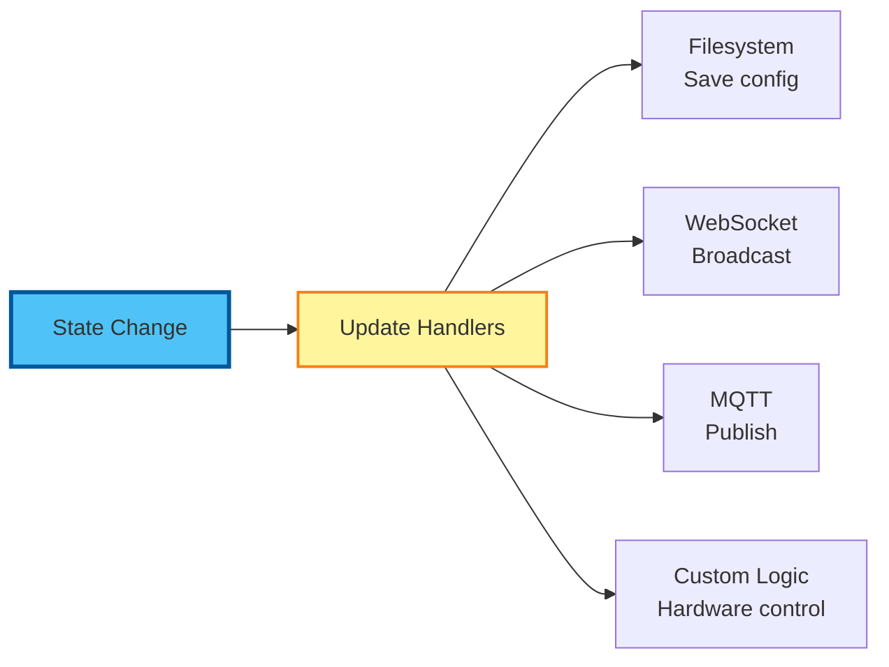

### Origin Tracking for Circular Prevention

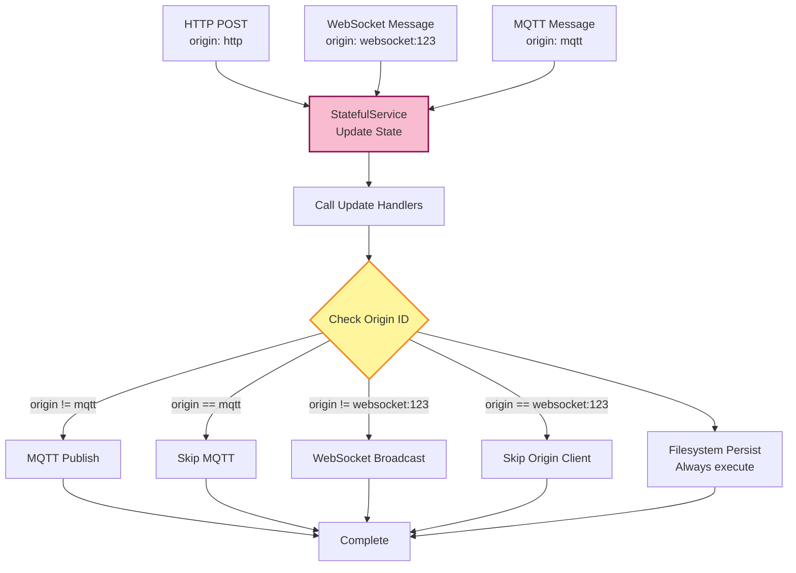

## REST API Data Flow

### Request Flow (GET)

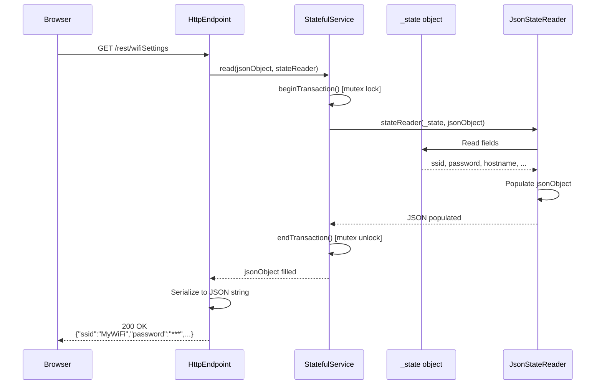

### Request Flow (POST)

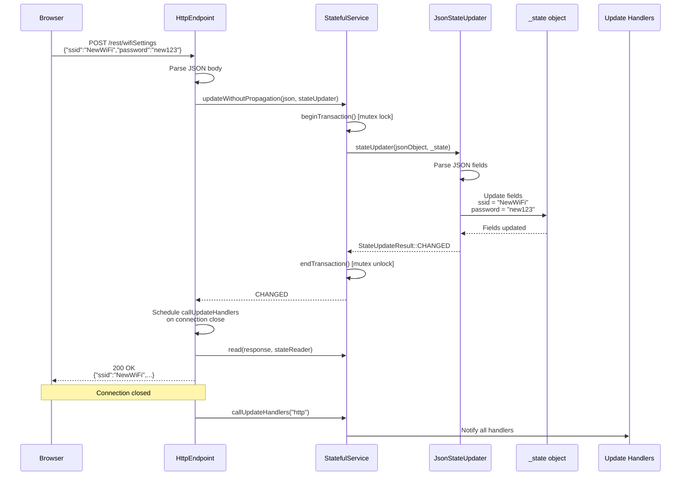

### Data Transformation (Serialization)

**State Object → JSON**:
```cpp
// Input: WiFiSettings object
{
    ssid: "MyWiFi",
    password: "secret123",
    hostname: "esp8266-device",
    staticIPConfig: false
}

// Output: JsonObject
{
    "ssid": "MyWiFi",
    "password": "secret123",
    "hostname": "esp8266-device",
    "static_ip_config": false
}
```

**JSON → State Object**:
```cpp
// Input: JsonObject
{
    "ssid": "NewWiFi",
    "password": "newsecret",
    "hostname": "my-device"
}

// Output: WiFiSettings object
{
    ssid: "NewWiFi",
    password: "newsecret",
    hostname: "my-device",
    staticIPConfig: false  // Not in JSON, use default
}
```

## WebSocket Data Flow

### Connection Establishment

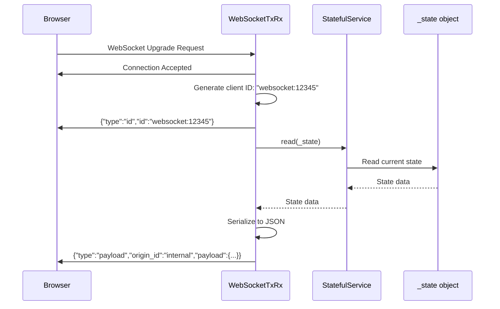

### Bidirectional Update

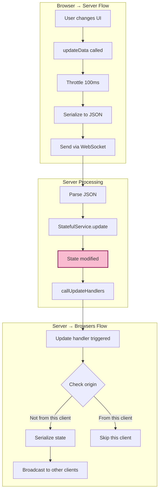

### Message Format

**Type 1: Client ID**
```json
{
    "type": "id",
    "id": "websocket:12345"
}
```

**Type 2: Payload Update**
```json
{
    "type": "payload",
    "origin_id": "http",
    "payload": {
        "led_on": true
    }
}
```

### Client-Side State Sync

```typescript
// Receive from server
ws.onmessage = (event) => {
    const msg = JSON.parse(event.data);
    
    if (msg.type === "id") {
        clientId = msg.id;  // Store our ID
    }
    
    if (msg.type === "payload") {
        if (msg.origin_id !== clientId) {
            // Update from external source
            setData(msg.payload);
        }
        // Ignore our own updates
    }
};

// Send to server
const updateData = (newData) => {
    const json = JSON.stringify(newData);
    ws.send(json);
};
```

## MQTT Data Flow

### Publish Flow

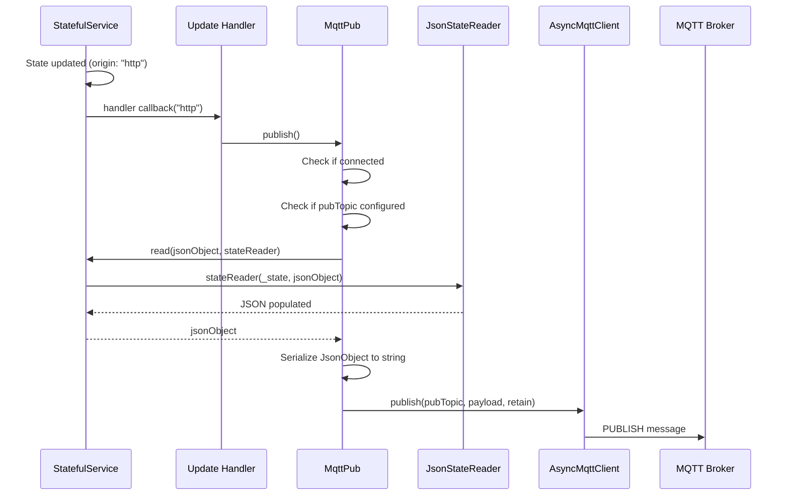

### Subscribe Flow

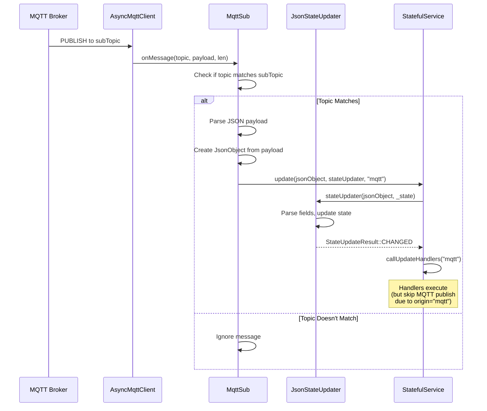

### Home Assistant Data Format

**Standard Format (REST/WebSocket)**:
```json
{
    "led_on": true
}
```

**Home Assistant Format (MQTT)**:
```json
{
    "state": "ON"
}
```

**Conversion in Code**:
```cpp
// Standard read
static void read(LightState& state, JsonObject& root) {
    root["led_on"] = state.ledOn;
}

// Home Assistant read
static void haRead(LightState& state, JsonObject& root) {
    root["state"] = state.ledOn ? "ON" : "OFF";
}

// Home Assistant update
static StateUpdateResult haUpdate(JsonObject& root, LightState& state) {
    String stateStr = root["state"] | "OFF";
    state.ledOn = (stateStr == "ON");
    return StateUpdateResult::CHANGED;
}
```

## Filesystem Data Flow

### Read Flow (Initialization)

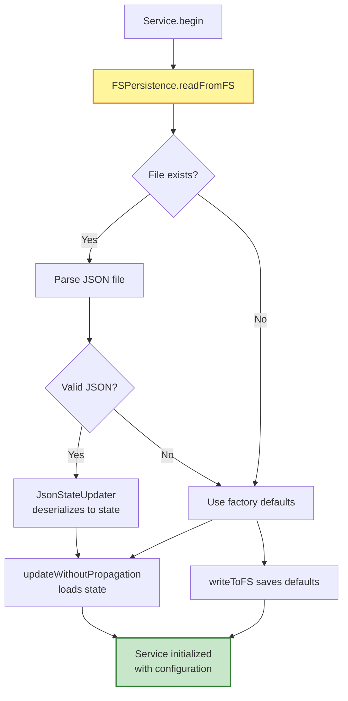

### Write Flow (Auto-Save)

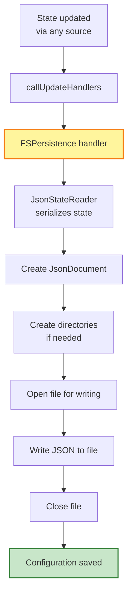

### File Structure

```
/config/
├── wifiSettings.json        # WiFi configuration
├── apSettings.json           # Access Point configuration
├── mqttSettings.json         # MQTT broker configuration
├── ntpSettings.json          # NTP configuration
├── otaSettings.json          # OTA settings
├── securitySettings.json     # Users and JWT secret
└── brokerSettings.json       # Custom project settings (demo)
```

### JSON File Example

`/config/wifiSettings.json`:
```json
{
  "ssid": "MyHomeWiFi",
  "password": "mysecretpassword",
  "hostname": "esp8266-light",
  "static_ip_config": false,
  "local_ip": "0.0.0.0",
  "gateway_ip": "0.0.0.0",
  "subnet_mask": "0.0.0.0",
  "dns_ip_1": "0.0.0.0",
  "dns_ip_2": "0.0.0.0"
}
```

## Frontend Data Flow

### React State Management

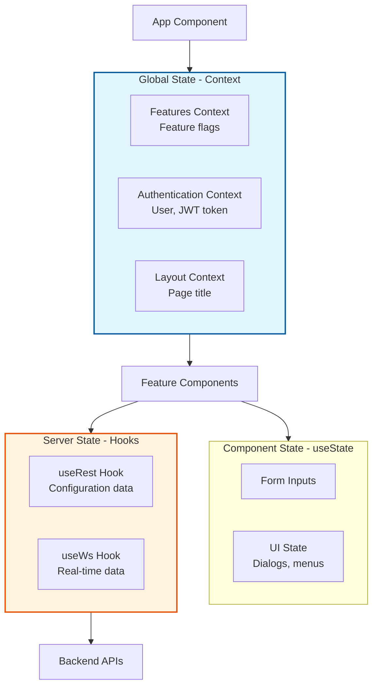

### useRest Hook Flow

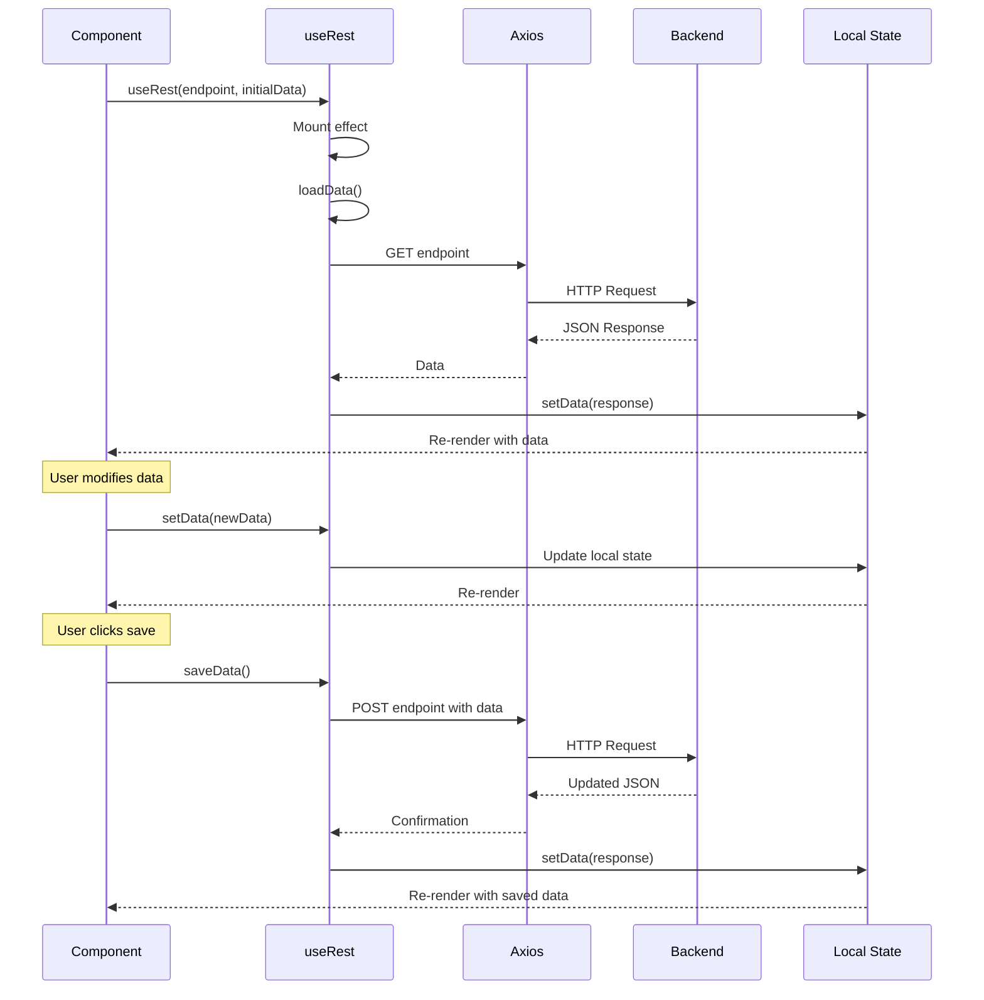

### useWs Hook Flow

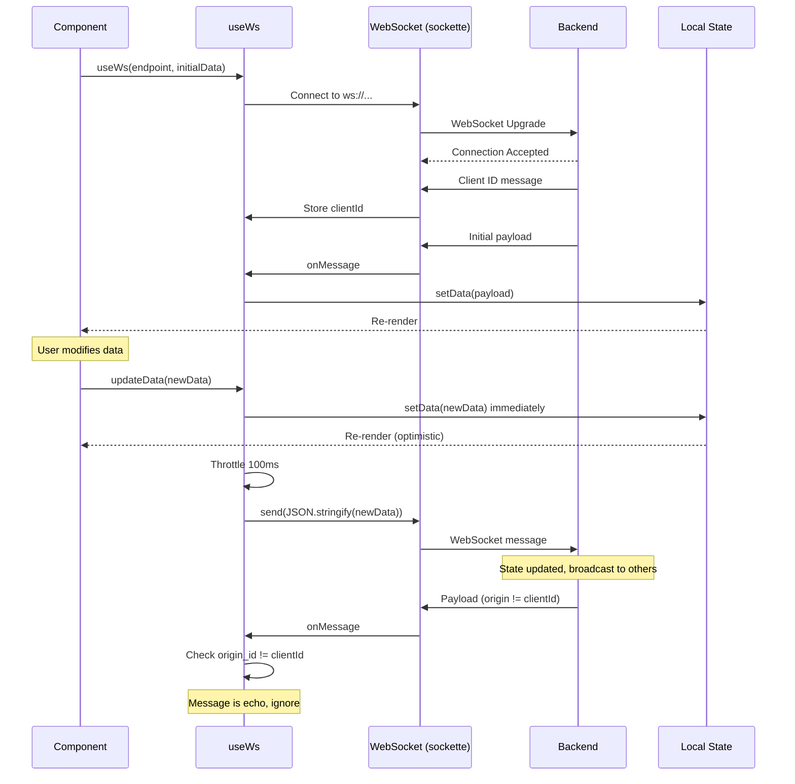

### Axios Request Interceptor

```typescript
// Add JWT token to all requests
axios.interceptors.request.use(
    (config) => {
        const token = localStorage.getItem('access_token');
        if (token) {
            config.headers.Authorization = `Bearer ${token}`;
        }
        return config;
    },
    (error) => Promise.reject(error)
);

// Handle 401 responses
axios.interceptors.response.use(
    (response) => response,
    (error) => {
        if (error.response?.status === 401) {
            // Clear token and redirect to sign-in
            localStorage.removeItem('access_token');
            window.location.href = '/';
        }
        return Promise.reject(error);
    }
);
```

## Data Validation and Error Handling

### Backend Validation

```cpp
// In JsonStateUpdater
static StateUpdateResult update(JsonObject& root, WiFiSettings& settings) {
    // Extract and validate
    settings.ssid = root["ssid"] | "";
    if (settings.ssid.length() == 0 || settings.ssid.length() > 32) {
        return StateUpdateResult::ERROR;  // Invalid SSID length
    }
    
    settings.password = root["password"] | "";
    if (settings.password.length() > 64) {
        return StateUpdateResult::ERROR;  // Invalid password length
    }
    
    // All validations passed
    return StateUpdateResult::CHANGED;
}
```

### Frontend Validation

```typescript
// async-validator schema
const schema = new Schema({
    ssid: [
        { required: true, message: 'SSID is required' },
        { max: 32, message: 'SSID must be 32 characters or less' }
    ],
    password: [
        { required: true, message: 'Password is required' },
        { min: 8, message: 'Password must be at least 8 characters' },
        { max: 64, message: 'Password must be 64 characters or less' }
    ]
});

// Validate before submit
schema.validate(formData, (errors) => {
    if (errors) {
        setErrors(errors);  // Display errors to user
    } else {
        saveData();  // Submit to backend
    }
});
```

## Performance Considerations

### Throttling and Debouncing

**WebSocket Updates** (100ms throttle):
```typescript
// Throttle rapid updates
const throttledUpdate = throttle((data) => {
    ws.send(JSON.stringify(data));
}, 100);
```

**Network Scanning** (debounce):
```typescript
// Debounce scan requests
const debouncedScan = debounce(() => {
    fetchNetworks();
}, 500);
```

### Buffer Sizing

**Backend JSON Buffers**:
```cpp
// Default buffer size: 1024 bytes
#define DEFAULT_BUFFER_SIZE 1024

// Service-specific sizes
HttpEndpoint<Settings> endpoint(
    reader, updater, service, server, path,
    securityManager, predicate,
    2048  // Larger buffer for complex settings
);
```

### Memory Management

**ArduinoJson Memory**:
```cpp
// Dynamic allocation for variable-sized data
DynamicJsonDocument doc(1024);

// Calculation for required size
size_t capacity = JSON_OBJECT_SIZE(10) + JSON_ARRAY_SIZE(5) + 512;
DynamicJsonDocument doc(capacity);
```

## Next Steps

- [API-REFERENCE.md](API-REFERENCE.md) - Complete API contracts
- [SEQUENCE-DIAGRAMS.md](SEQUENCE-DIAGRAMS.md) - Interaction flows
- [DESIGN-PATTERNS.md](DESIGN-PATTERNS.md) - Implementation patterns
