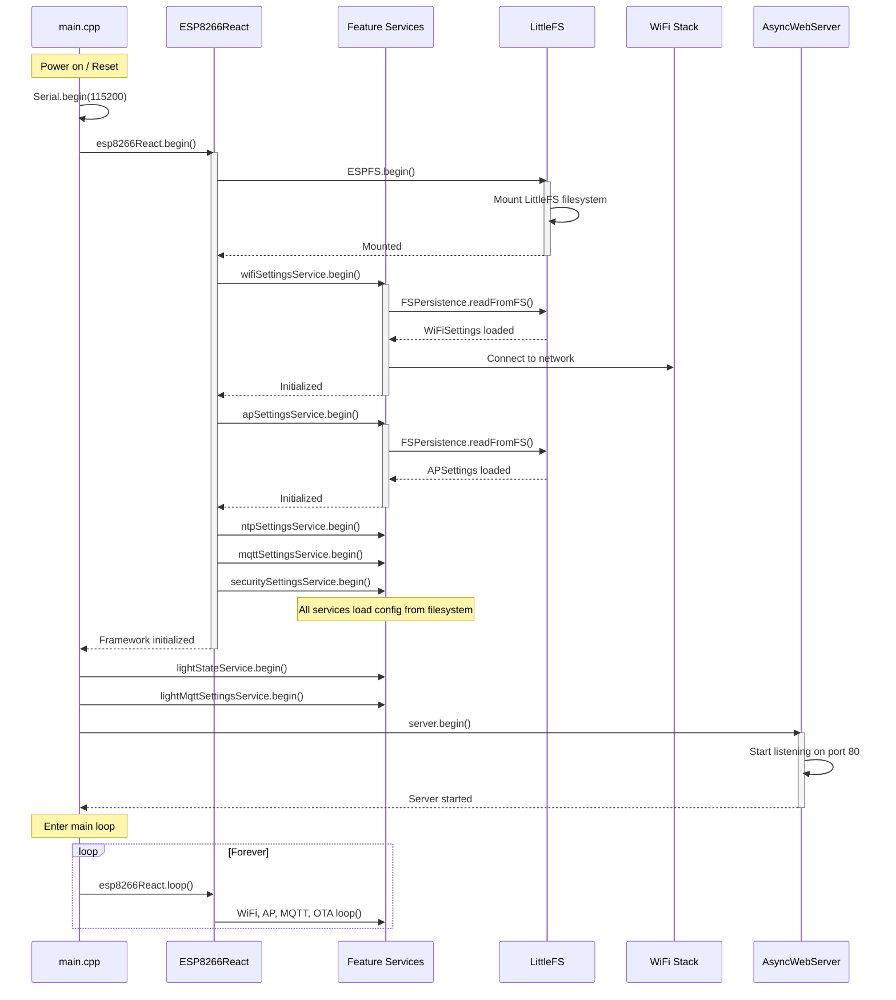
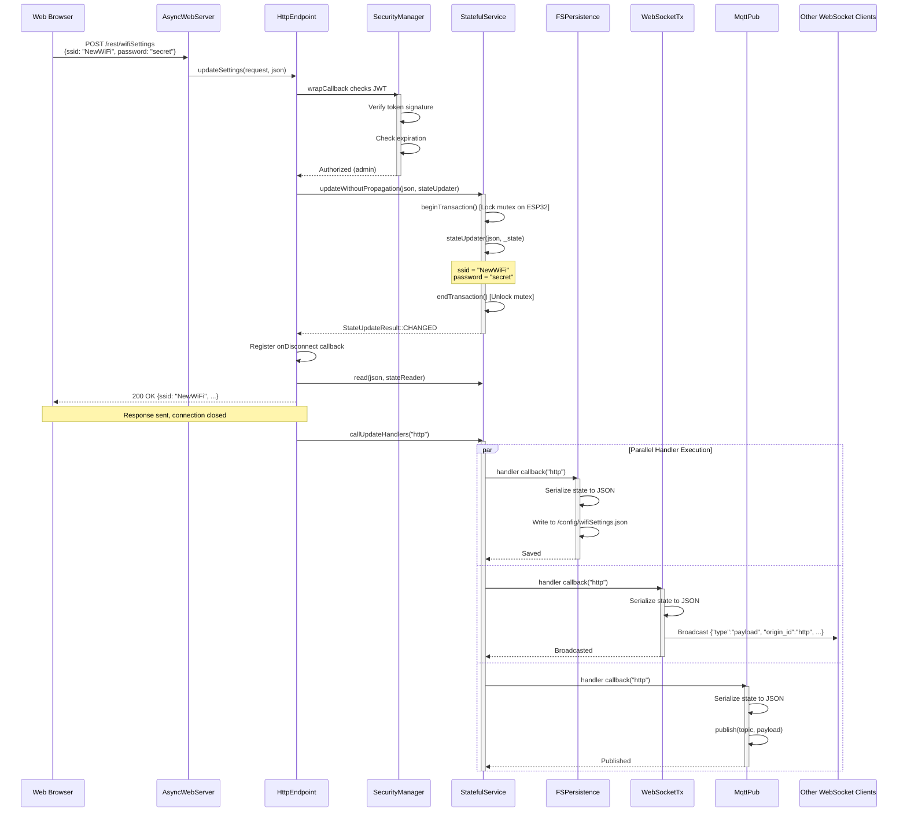
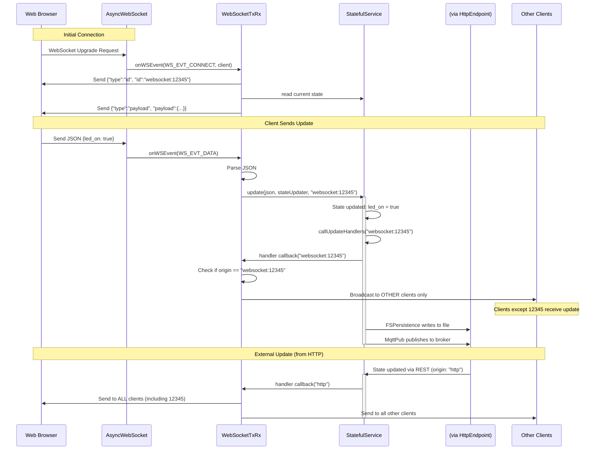
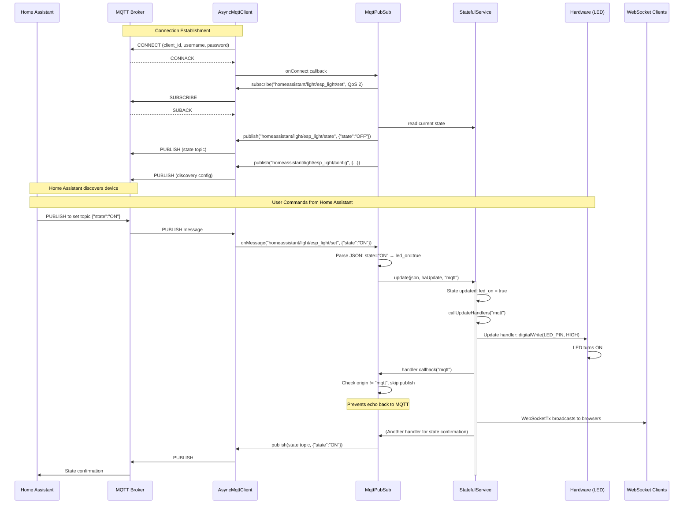
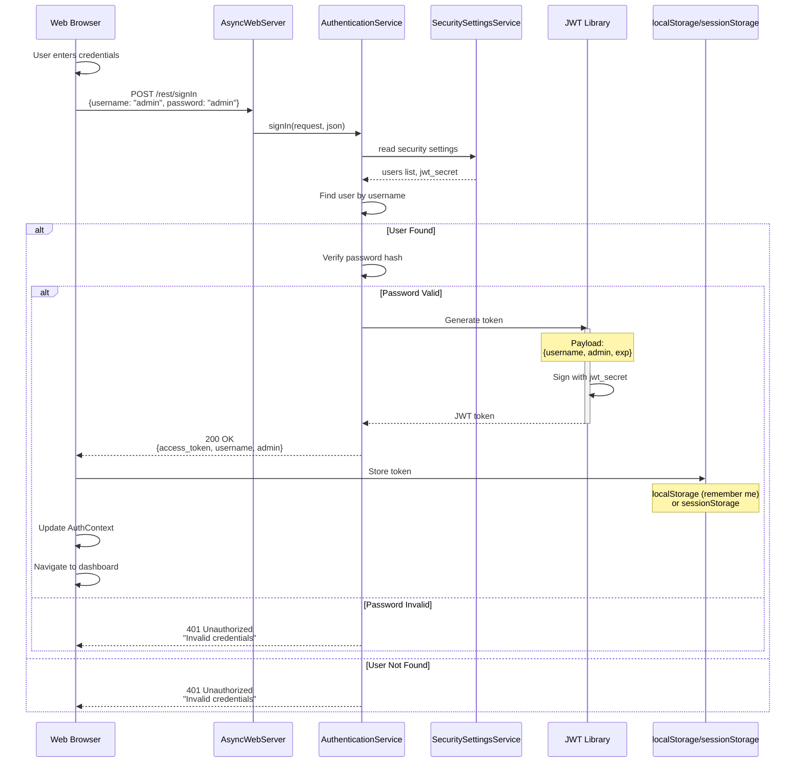
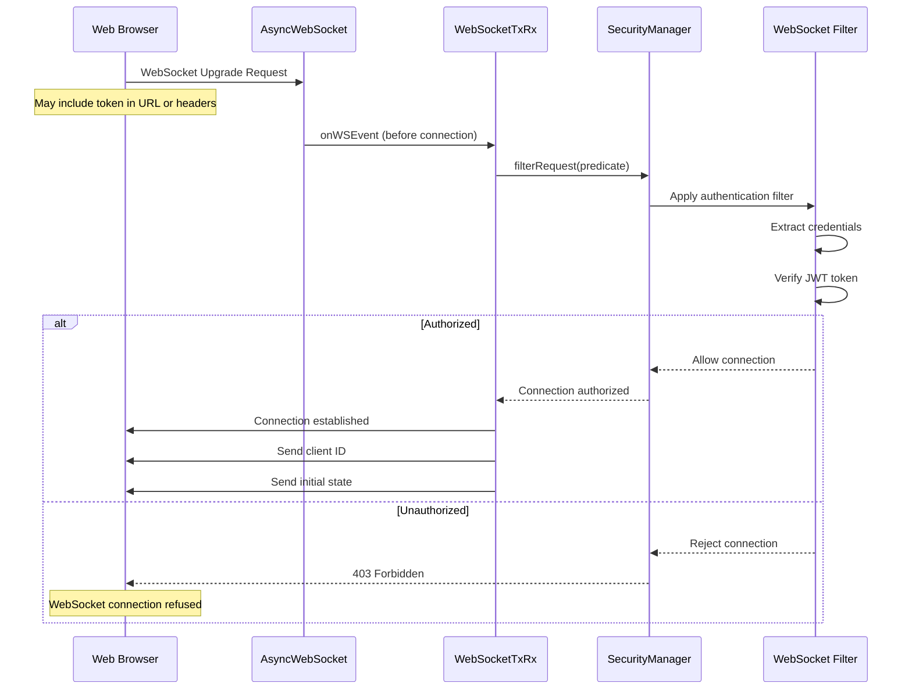
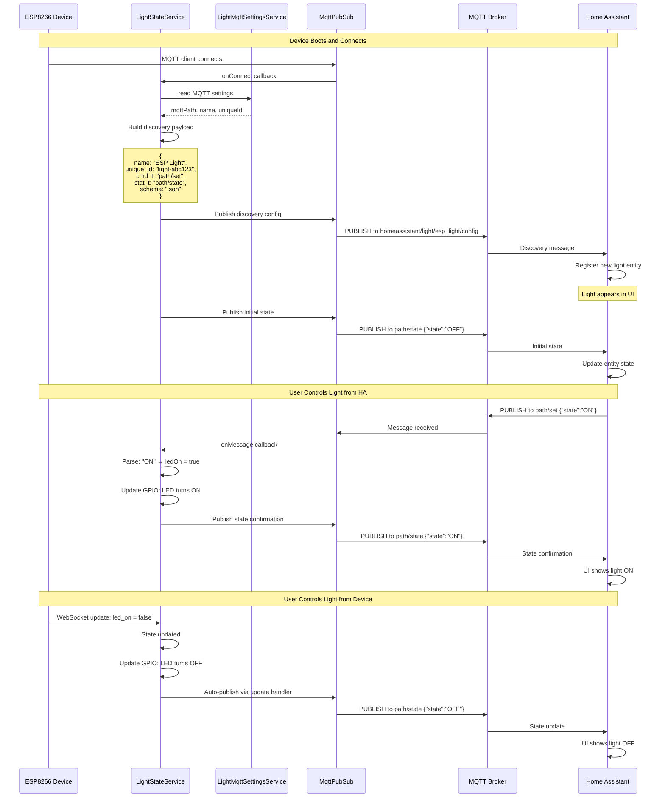
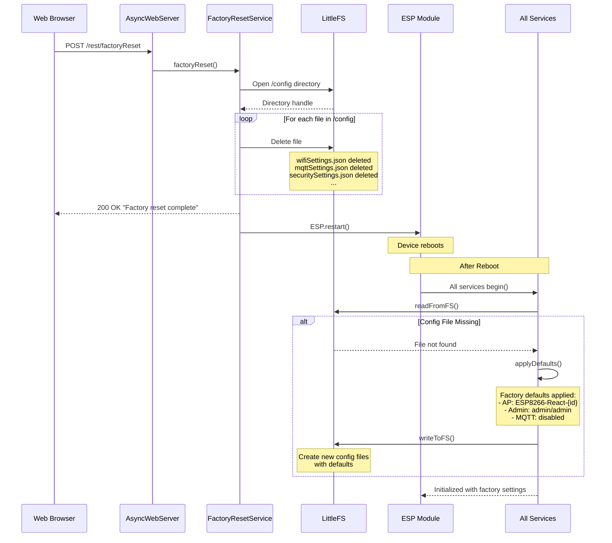
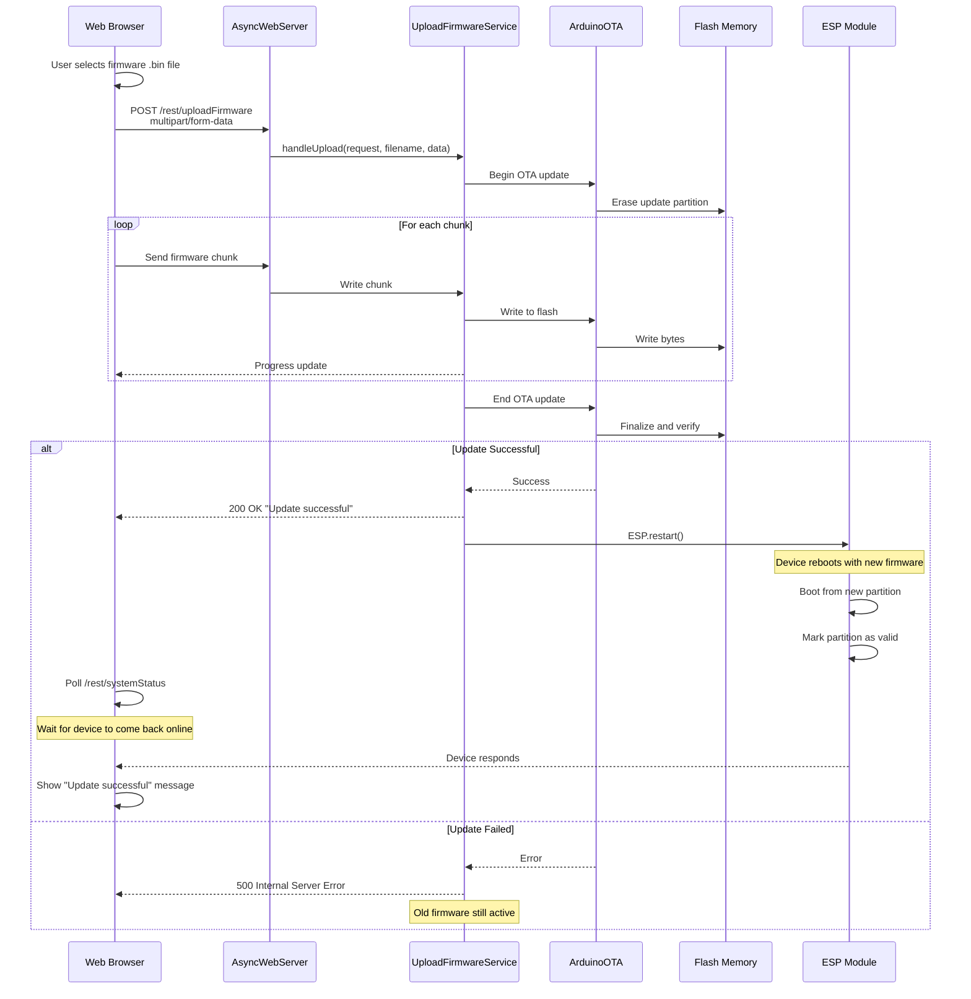

# Sequence Diagrams

## Overview

This document provides detailed sequence diagrams showing the interaction flows between components in the ESP8266-React framework. These diagrams illustrate how components collaborate to accomplish specific tasks.

## System Initialization

### Main Initialization Sequence



### Service Registration Sequence

```mermaid
sequenceDiagram
    participant Constructor as Service Constructor
    participant Service as StatefulService&lt;T&gt;
    participant HTTP as HttpEndpoint
    participant WS as WebSocketTxRx
    participant FSP as FSPersistence
    participant MQTT as MqttPubSub
    participant Server as AsyncWebServer
    
    Constructor->>HTTP: new HttpEndpoint(read, update, this, server, path, security)
    activate HTTP
    HTTP->>Server: server->on(path, HTTP_GET, handler)
    HTTP->>Server: server->addHandler(postHandler)
    HTTP-->>Constructor: Registered GET/POST handlers
    deactivate HTTP
    
    Constructor->>WS: new WebSocketTxRx(read, update, this, server, wsPath, security)
    activate WS
    WS->>Server: server->addHandler(&_webSocket)
    WS->>Service: addUpdateHandler(broadcast callback)
    WS-->>Constructor: WebSocket registered
    deactivate WS
    
    Constructor->>FSP: new FSPersistence(read, update, this, fs, filePath)
    activate FSP
    FSP->>Service: addUpdateHandler(writeToFS callback)
    FSP-->>Constructor: Auto-save enabled
    deactivate FSP
    
    Constructor->>MQTT: new MqttPubSub(read, update, this, mqttClient, pubTopic, subTopic)
    activate MQTT
    MQTT->>Service: addUpdateHandler(publish callback)
    MQTT->>MQTT: mqttClient->onConnect(subscribe callback)
    MQTT->>MQTT: mqttClient->onMessage(receive callback)
    MQTT-->>Constructor: MQTT pub/sub configured
    deactivate MQTT
```

## State Update Flows

### REST API Update Flow



### WebSocket Bidirectional Flow



### MQTT Integration Flow



## Authentication Flow

### Sign In Sequence



### Authenticated Request Flow

```mermaid
sequenceDiagram
    participant Browser as Web Browser
    participant Axios as Axios Interceptor
    participant Storage as Token Storage
    participant Server as AsyncWebServer
    participant SecMgr as SecurityManager
    participant JWT as JWT Validation
    participant Handler as Request Handler
    
    Browser->>Axios: GET /rest/securitySettings
    Axios->>Storage: getToken()
    Storage-->>Axios: "eyJ0eXAi..."
    
    Axios->>Axios: Add Authorization header:<br/>"Bearer eyJ0eXAi..."
    Axios->>Server: GET with Authorization header
    
    Server->>SecMgr: wrapRequest checks predicate
    SecMgr->>SecMgr: Extract token from header
    
    SecMgr->>JWT: Decode and verify token
    activate JWT
    JWT->>JWT: Verify signature with jwt_secret
    JWT->>JWT: Check expiration
    
    alt Token Valid
        JWT-->>SecMgr: Decoded payload {username, admin}
        deactivate JWT
        
        SecMgr->>SecMgr: Check predicate (IS_ADMIN)
        
        alt User is Admin
            SecMgr->>Handler: Execute handler
            Handler->>Handler: Process request
            Handler-->>Browser: 200 OK with data
        else User Not Admin
            SecMgr-->>Browser: 403 Forbidden
        end
    else Token Invalid or Expired
        JWT-->>SecMgr: Verification failed
        deactivate JWT
        SecMgr-->>Browser: 401 Unauthorized
        
        Browser->>Browser: Clear token from storage
        Browser->>Browser: Redirect to /sign-in
    end
```

### WebSocket Authentication



## MQTT Home Assistant Discovery

### Discovery and State Synchronization



## Factory Reset Flow



## OTA Update Flow



## Next Steps

- [DATA-FLOWS.md](DATA-FLOWS.md) - Data movement patterns
- [API-REFERENCE.md](API-REFERENCE.md) - Complete API documentation
- [DESIGN-PATTERNS.md](DESIGN-PATTERNS.md) - Implementation patterns
